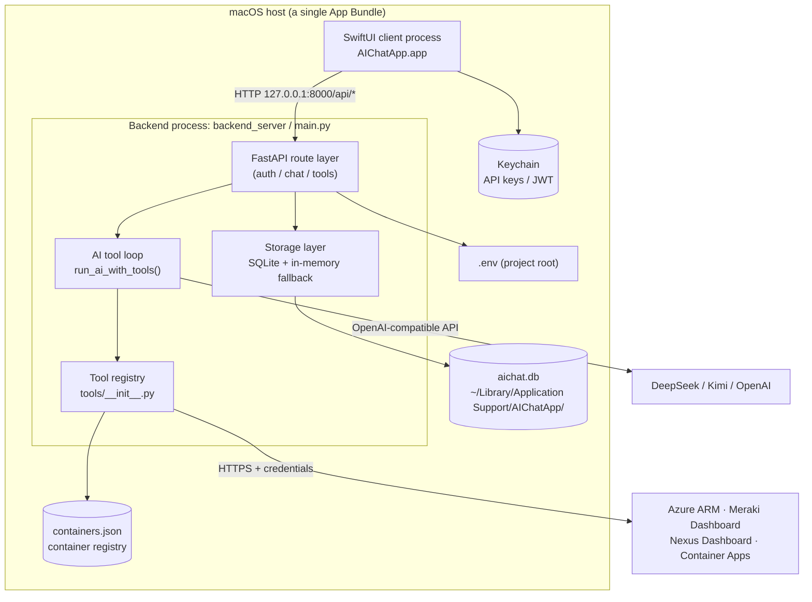
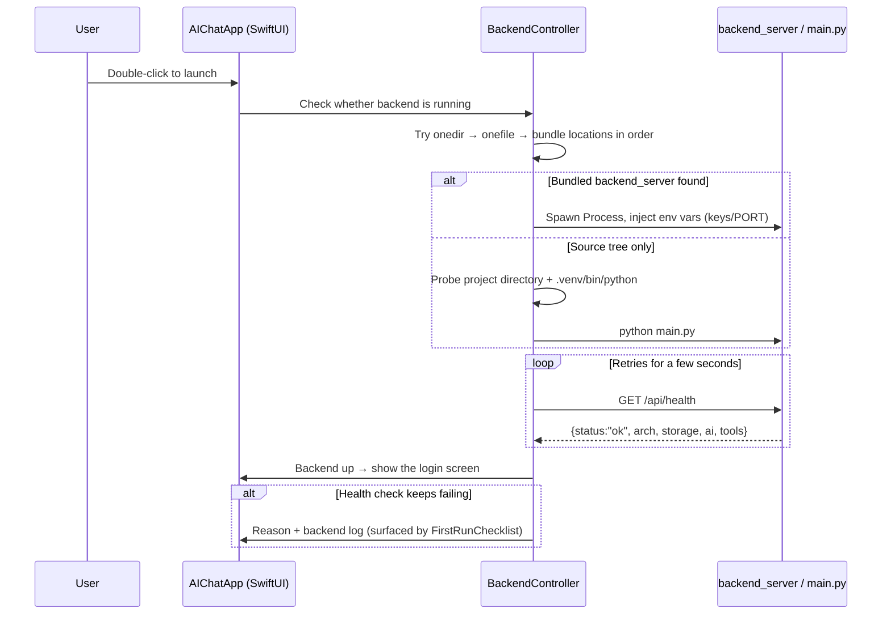
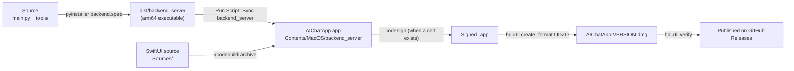

# AIChatApp — Architecture and Workflow Guide

> **Audience: developers.** This document explains what the App is made of, how a single
> chat request flows through the system, how tools get attached to the model, where data is
> stored, and how the source tree becomes a shippable DMG.
>
> End-user install/usage instructions live in the root [`README.md`](../README.md);
> client-specific details live in [`AIChatApp/README.md`](../AIChatApp/README.md).
>
> 中文版：[`ARCHITECTURE.md`](ARCHITECTURE.md)

---

## Table of contents

1. [One-paragraph summary](#1-one-paragraph-summary)
2. [Architecture at a glance](#2-architecture-at-a-glance)
3. [Component responsibilities](#3-component-responsibilities)
4. [Directory layout, file by file](#4-directory-layout-file-by-file)
5. [Runtime workflows](#5-runtime-workflows)
6. [The tool subsystem](#6-the-tool-subsystem)
7. [Data storage and configuration](#7-data-storage-and-configuration)
8. [Authentication and security model](#8-authentication-and-security-model)
9. [Build and release pipeline](#9-build-and-release-pipeline)
10. [Test matrix](#10-test-matrix)
11. [Common development tasks](#11-common-development-tasks)
12. [Known inconsistencies and tech debt](#12-known-inconsistencies-and-tech-debt)
13. [Appendix: endpoints and key constants](#13-appendix-endpoints-and-key-constants)

---

## 1. One-paragraph summary

AIChatApp is an AI operations workbench that runs **entirely on your own Mac**:

- The **front end** is a native macOS SwiftUI client (`AIChatApp.app`);
- The **back end** is a FastAPI service running on the same machine (`main.py`, or the packaged
  `backend_server`);
- The two talk only over `http://127.0.0.1:8000/api/*`;
- The model reaches the outside world through **function calling** against 101 read-only
  operations tools covering Azure, Meraki, Cisco Nexus Dashboard, Serverless containers and
  DeepSeek balance;
- AI provider keys live only in the local `.env` and the macOS Keychain — they never leave the machine.

Three hard design constraints:

| Constraint | How it is enforced |
|---|---|
| **Apple Silicon native arm64 only** | `main.py` detects Rosetta at startup and refuses to run; `backend.spec` / `build_dmg.sh` hard-verify the architecture |
| **Local first, no cloud dependency** | The back end binds to `127.0.0.1` by default; SQLite persistence; the client spawns the backend process itself |
| **Backward-compatible API contract** | The old Azure Functions paths and response shapes are preserved (`chat_async` + `ai_task_status` polling) |

---

## 2. Architecture at a glance

### 2.1 Processes and network topology



### 2.2 Layered view

```
┌────────────────────────────────────────────────────────────────────┐
│ Presentation  AIChatApp/Sources/Views/  RootView / LoginView /      │
│                                        ChatView / SettingsView      │
├────────────────────────────────────────────────────────────────────┤
│ State         ViewModels/ + Services/   ChatViewModel polls;        │
│                                        SessionStore holds global     │
│                                        state; AppSettings uses       │
│                                        UserDefaults                │
├────────────────────────────────────────────────────────────────────┤
│ Transport     Services/APIClient.swift  login / chat_async /        │
│                                        ai_task_status / conversations│
├──────────────────────── HTTP (127.0.0.1) ──────────────────────────┤
│ Routing       main.py @app.post/get     13 REST endpoints           │
├────────────────────────────────────────────────────────────────────┤
│ Orchestration run_ai_with_tools()       multi-round function calling│
├────────────────────────────────────────────────────────────────────┤
│ Capabilities  tools/*.py                101 tools (5 groups)        │
├────────────────────────────────────────────────────────────────────┤
│ Storage       SQLite conversations/tasks + in-memory fallback       │
└────────────────────────────────────────────────────────────────────┘
```

---

## 3. Component responsibilities

| Component | Location | Responsibility |
|---|---|---|
| **SwiftUI client** | `AIChatApp/Sources/` | Login, chat and settings screens; **spawns the local Python backend** when it is not bundled |
| **BackendController** | `AIChatApp/Sources/Services/BackendController.swift` | Locates `backend_server` (onedir > onefile > project `main.py`), starts/stops the process, `/api/health` checks, dependency self-check, log capture, orphan process cleanup |
| **APIClient** | `AIChatApp/Sources/Services/APIClient.swift` | The single HTTP egress point; wraps all 13 endpoints and attaches the JWT |
| **ChatViewModel** | `AIChatApp/Sources/ViewModels/ChatViewModel.swift` | Submits `chat_async`, then **polls `ai_task_status` every 2 seconds** and renders the tool-call log |
| **AppSettings** | `AIChatApp/Sources/Services/AppSettings.swift` | Backend URL, credentials, language/font scale; writes UserDefaults and Keychain, optionally syncs back to `.env` |
| **FastAPI backend** | `main.py` (2802 lines) | Routing, auth, AI orchestration, tool loop, SQLite persistence |
| **Tool registry** | `tools/__init__.py` | `default_schemas()` / `execute_tool()` / `health()` — the only three entry points, dispatching to 5 modules |
| **Tool modules** | `tools/{azure,meraki,nexus_dashboard,container,ai}_tools.py` | Each exports `SCHEMAS` / `TOOL_NAMES` / `execute()` / `health()` |
| **Legacy implementation** | `function_app.py` (263 KB) | The old Azure Functions version; **reference only, never imported at runtime** |
| **Packaging scripts** | `backend.spec`, `AIChatApp/scripts/build_dmg.sh`, `scripts/arm64_native.sh` | PyInstaller packaging for the backend, archive + codesign + DMG for the client, arm64 guardrails |

---

## 4. Directory layout, file by file

```
MyMacApp/
├── main.py                       # ★ The only supported backend: routes + AI orchestration + tool loop + storage
├── tools/                        # ★ Tool suite callable by the AI (registry pattern)
│   ├── __init__.py               #   MODULES dict + default_schemas/execute_tool/health
│   ├── azure_tools.py            #   21 Azure tools (DefaultAzureCredential + ARM REST)
│   ├── meraki_tools.py           #   45 Meraki tools (httpx straight to the Dashboard REST API)
│   ├── nexus_dashboard_tools.py  #   31 Nexus Dashboard tools (Infra API + Manage API, read-only)
│   ├── container_tools.py        #    3 Serverless container tools (registry-driven, hot-reloaded)
│   └── ai_tools.py               #    1 AI tool (DeepSeek balance)
├── function_app.py               # [legacy] original Azure Functions implementation, reference only
├── requirements-fastapi.txt      # Backend dependencies
├── .env.example                  # Environment variable template (all knobs, with comments)
├── backend.spec                  # PyInstaller config (onefile by default; PYI_ONEDIR=1 for a directory build)
├── scripts/
│   ├── arm64_native.sh           # Shared "must be native arm64" helper (sourced by other scripts)
│   ├── run_native_arm64.sh       # Run the backend with a native arm64 Python
│   └── verify_backend_binary.py  # End-to-end check of a packaged binary (spawn, hit endpoints, inspect arch)
├── test_*.py                     # 8 unittest files (see §10)
├── AIChatApp/                    # ★ macOS SwiftUI client (Xcode project)
│   ├── AIChatApp.xcodeproj/      #   Xcode project + shared scheme
│   ├── Sources/
│   │   ├── AIChatAppApp.swift    #   @main entry point, wires up shared environment objects
│   │   ├── Models/               #   APIModels / ToolCallLog / AppLanguage / SettingsSection
│   │   ├── Services/             #   APIClient / BackendController / AppSettings /
│   │   │                         #   KeychainStore / SessionStore / Localization*
│   │   ├── ViewModels/           #   ChatViewModel / ConnectionTester / FirstRunChecklist
│   │   └── Views/                #   Root / Login / Chat / Settings / Components /
│   │                             #   FirstRunChecklistView / AppTypography
│   ├── Assets.xcassets/          #   App icon
│   ├── Support/Info.plist        #   Includes NSAllowsLocalNetworking (permits 127.0.0.1)
│   ├── scripts/                  #   build_dmg.sh (archive→codesign→DMG), make_icons.swift
│   └── README.md                 #   Detailed client documentation
├── README.md                     # User-facing overview
├── SECURITY.md                   # Security policy
├── LICENSE                       # MIT
└── docs/                         # ← This document and its Chinese counterpart
```

**Runtime data (never committed — see `.gitignore`)**

| Path | Contents |
|---|---|
| `~/Library/Application Support/AIChatApp/aichat.db` | SQLite: conversation history + async tasks |
| `~/Library/Application Support/AIChatApp/containers.json` | Serverless container registry |
| `~/Library/Logs/AIChatApp/backend.log` | Bundled backend log |
| `<project root>/.env` | Local configuration and keys (**never commit**) |
| `dist/`, `build/`, `*.dmg`, `AIChatApp/Resources/backend_server/` | Build artifacts |

---

## 5. Runtime workflows

### 5.1 Startup (cold launch of the App)



Details:

- On startup `_enforce_native_arm64()` runs **before** any third-party import, so a Rosetta-translated
  process gets a clear message and exits (`ALLOW_ROSETTA=true` is the escape hatch).
- `lifespan` does two things: log the architecture report, and size the Starlette thread pool to the CPU count.
- `_init_storage()` creates the `conversations` / `tasks` tables; on failure it falls back to an
  in-memory backend so **the service still starts**.

### 5.2 Login (three paths)

| Path | Flow | Required configuration |
|---|---|---|
| **Local admin** (break-glass) | `POST /api/login` validates `ADMIN_USERNAME`/`ADMIN_PASSWORD` → issues a JWT | None (defaults exist) |
| **Google OAuth** | `POST /auth/google/start` returns an authorization URL (Authorization Code + **PKCE**) → system browser authorizes → `GET /auth/google/callback` validates state and the email/domain allowlist → an HTML page reports success → the client polls `GET /auth/google/status` to collect the JWT | `GOOGLE_CLIENT_ID` (+ optional `GOOGLE_ALLOWED_EMAILS`/`DOMAINS`) |
| **GitHub Device Flow** | `POST /auth/github/start` returns a `user_code` (the App copies it to the clipboard and opens `github.com/login/device`) → the client polls `GET /auth/github/status`; the backend exchanges the device code, reads the identity and checks the allowlist → returns a backend JWT | `GITHUB_CLIENT_ID` (+ optional `GITHUB_ALLOWED_LOGINS`/`EMAILS`) |

All three paths end up issuing **the same backend JWT** (HS256, 24 h by default); the client stores it
in the Keychain. The Google access token is used briefly on the backend to read the identity and never
reaches the client.

The auth entry point is the FastAPI dependency `require_auth()`: it prefers
`Authorization: Bearer <JWT>`, falls back to `X-MS-CLIENT-PRINCIPAL` (compatibility with older
Easy Auth deployments), and returns 401 if neither works.

### 5.3 A full chat request (the core flow)

```mermaid
sequenceDiagram
    autonumber
    participant U as User
    participant CV as ChatViewModel
    participant API as APIClient
    participant BE as main.py
    participant LOOP as run_ai_with_tools
    participant T as tools/*
    participant DB as SQLite
    participant LLM as DeepSeek / Kimi

    U->>CV: Type a prompt, hit send
    CV->>API: POST /api/chat_async {prompt, enable_tools, conversation_id}
    API->>BE: (Bearer JWT)
    BE->>BE: require_auth() → _create_task() persists status=pending
    BE-->>API: 202 {instance_id}
    BE->>BE: BackgroundTask → _run_chat_task(instance_id, payload)

    par Client polls
        loop Every 2 seconds
            CV->>API: GET /api/ai_task_status?instance_id=...
            API->>BE: Read the tasks table
            BE-->>API: {status: pending|running|completed|failed}
        end
    and Backend executes
        BE->>BE: build_chat_messages() (system prompt + history + image/file context)
        BE->>LOOP: messages, tools="default"
        loop Up to MAX_TOOL_ITERATIONS (15)
            LOOP->>LLM: chat.completions.create(messages, tools)
            LLM-->>LOOP: text or tool_calls
            alt tool_calls present
                LOOP->>LOOP: dedupe within the round + signature counting (loop guard)
                LOOP->>T: execute_tool(name, args)
                T-->>LOOP: JSON string result
                LOOP->>LOOP: Append role=tool message, continue
            else plain text
                LOOP-->>BE: {response, tool_calls_log, stop_reason}
            end
        end
        BE->>DB: _save_conversation() (assistant message + tool log together)
        BE->>DB: _update_task(status=completed)
    end
    CV->>CV: Poll sees completed → render bubble + collapsible tool-call panel
```

**Key points**

- `chat_async` returns an `instance_id` immediately (HTTP 202); execution happens on a Starlette
  thread-pool worker (`_run_chat_task` is a sync function, so it never blocks the event loop).
  The synchronous `POST /api/chat` entry point remains available, capped at 360 seconds
  (`AI_REQUEST_TIMEOUT_SECONDS`).
- In the request body, `prompt` (single turn) and `messages` (multi-turn) are mutually exclusive.
  All 101 tool schemas are only attached when `enable_tools: true` (the default can be flipped with
  `TOOLS_ENABLED_BY_DEFAULT`).
- History passes through `_sanitize_history()` before being sent to the model, stripping custom
  fields such as `tool_calls_log`.
- When images are present and the provider is DeepSeek, the request automatically switches to the
  vision model (`DEEPSEEK_VISION_MODEL_NAME`).
- Every model call records `usage`; `/api/health` reports the running totals.

### 5.4 Graceful winding-down when the tool loop "won't stop"

The old behaviour raised an exception ("exceeded max iterations"). Today **all three stop reasons
still produce a final answer**:

| `stop_reason` | Trigger | Handling |
|---|---|---|
| `completed` | The model replied with text | Normal return |
| `iteration_limit` | Hit `MAX_TOOL_ITERATIONS` (15 by default, overridable per request, capped at 50) | Send one more **tool-free** request to wrap up |
| `repeated_tool_calls` | Same `(tool name, arguments)` already executed `MAX_IDENTICAL_TOOL_CALLS` (2) times | Same as above, and further calls with that signature are skipped |

If the wrap-up request also fails, the backend degrades to `_fallback_tool_summary()` — a summary of the
tool results gathered so far — so the user at least sees what was found and where it got stuck.
Additionally: identical calls within one round execute only once (result reuse), and after
`MAX_TOOL_ERRORS_BEFORE_NOTICE` (3) consecutive failures of the same tool, the tool result gains a
"stop retrying this" hint.

### 5.5 Conversation persistence

- A conversation is keyed by `conversation_id` in the `conversations` table
  (`id / title / messages / updated_at / message_count`). `messages` is a full JSON array, and
  **assistant messages carry `tool_calls_log`**, so tool calls remain visible in history.
- The title is derived from the first user message by `_derive_title()`.
- The sidebar uses `GET /api/chat_conversations` (no message bodies, newest first); opening a
  conversation uses `GET /api/chat_history`; deleting uses `DELETE /api/chat_conversation`.
- Async tasks live in the `tasks` table; every lookup prunes expired rows using `TASK_TTL_HOURS`
  (24 h by default).
- The storage layer opens one connection per operation and runs in WAL mode, so it is safe for
  multiple threads/workers. To move to Postgres, the replacement points are concentrated in the
  "storage layer" section of `main.py`.

### 5.6 The settings write path

```
User enters a key in Settings
   └─▶ KeychainStore (macOS Keychain)
   └─▶ Optional: merge back into the project-root .env (other existing lines preserved)
   └─▶ Injected as environment variables when the backend process restarts:
       DEEPSEEK_API_KEY / KIMI_API_KEY / DEFAULT_AI_PROVIDER / AI_MOCK_MODE / PORT
Environment variables take precedence over .env (pre-existing system variables are never overwritten)
```

Container API keys are the convenient exception: the key is written to the Keychain **and** written
back into `containers.json`. The backend re-reads the registry on every call, so **the change takes
effect immediately, with no restart**.

---

## 6. The tool subsystem

### 6.1 Registry mechanism

`tools/__init__.py` exposes only three functions, and `main.py` never needs to know which tools exist:

```python
MODULES = {"azure", "meraki", "nexus_dashboard", "container", "ai"}  # order == schema order

default_schemas()   -> list[dict]     # fed straight into the OpenAI SDK's tools argument (101 total)
execute_tool(name, arguments) -> str|None  # JSON string; None = unregistered; failures are always {"status":"error",...}
health()            -> dict           # per-group credential/dependency status, used by /api/health
```

The standard way to add a tool module:

1. Create `tools/xxx_tools.py` exporting `SCHEMAS` (a list of OpenAI function schemas),
   `TOOL_NAMES`, `execute(name, arguments) -> str` and `health() -> dict`;
2. Add one line to `MODULES` in `tools/__init__.py`;
3. **No change to `main.py` is needed** — the schemas are attached automatically and
   `execute_tool` dispatches automatically.

Note: in `meraki_tools.py`, `SCHEMAS` / `ENDPOINTS` / `TOOL_SPECS` are three parallel tables —
keep them in sync when changing requirements.

### 6.2 Tool groups

| Group | Count | Transport / auth | Notes |
|---|---|---|---|
| **Azure** | 21 | `DefaultAzureCredential` (service principal or CLI) + ARM REST | Subscriptions/resource groups, VMs and CPU metrics, VNet/subnet/NSG inspection, Storage/Web/SQL/KeyVault/AKS/ACI inventory, KQL `query_resources`, monitoring metrics |
| **Meraki** | 45 | `X-Cisco-Meraki-API-Key` (`MERAKI_AUTH_HEADER=bearer` for OAuth), direct httpx calls | Organizations/networks/devices, VPN, uplinks, Appliance features (VLANs/ports/routing/L3·L7 firewall/NAT/port forwarding/IPS/content filtering/traffic shaping), switch ports and mirroring, wireless SSID/RF |
| **Nexus Dashboard** | 31 | API key (`X-Nd-Username` + `X-Nd-Apikey`) or username/password login exchanging for a token (cached in-process for 10 minutes, auto re-login on 401) | 17 official Infra API + 13 Manage API + 1 aggregate view (`nexus_overview`). **Read-only GETs throughout** |
| **Serverless containers** | 3 | Registry + `X-API-Key` | `container_list_endpoints` / `container_list_tasks` / `container_run_task`, allowlist-driven |
| **AI** | 1 | `DEEPSEEK_API_KEY` | `deepseek_get_balance` for account balance |

### 6.3 Container registry and allowlist

Configuration sources, in priority order (`registry_entries()`):

```
1) Environment variable CONTAINER_ENDPOINTS_JSON   (inline JSON; convenient for CI/tests)
2) Registry file AICHAT_CONTAINERS_FILE or
   ~/Library/Application Support/AIChatApp/containers.json   ← re-read on every call; edits apply instantly
3) Legacy compatibility: ANSIBLE_EXECUTOR_URL + ANSIBLE_EXECUTOR_API_KEY → synthesized as an entry named "ansible"
```

Key sources (inspectable via the `key_source` field): written by Settings into the Keychain **and**
back into the registry's `api_key` > `api_key` written directly into the registry > the
`api_key_env` / `AICHAT_CONTAINER_KEY_<UPPERCASED_NAME>` environment variable (in which case changing
the key requires a restart).

Allowlist evaluation (`mode: auto`, the default): explicitly listed in `allowed_tasks` → allowed;
marked `read_only: true` by the container's `GET /tasks` → allowed; otherwise fall back to a built-in
read-only list. **Write operations are blocked by default**, and the container's `POST /run-ansible`
— which can run arbitrary playbooks — is deliberately never exposed to the model (it is equivalent to
arbitrary code execution inside the container).

---

## 7. Data storage and configuration

### 7.1 SQLite schema

```sql
CREATE TABLE IF NOT EXISTS conversations (
    id            TEXT PRIMARY KEY,   -- conversation_id
    title         TEXT,               -- derived from the first user message
    messages      TEXT,               -- full message array (JSON), including tool_calls_log
    updated_at    TEXT,               -- microsecond-precision UTC ISO8601
    message_count INTEGER
);

CREATE TABLE IF NOT EXISTS tasks (
    instance_id TEXT PRIMARY KEY,     -- the instance ID returned by chat_async
    status      TEXT,                 -- pending / running / completed / failed
    result      TEXT,                 -- successful result JSON
    error       TEXT,                 -- failure reason
    created_at  TEXT,
    updated_at  TEXT
);
```

### 7.2 Environment variables

The full annotated list is in [`.env.example`](../.env.example); the most important groups:

| Variable | Purpose |
|---|---|
| `DEEPSEEK_API_KEY` / `KIMI_API_KEY` / `OPENAI_API_KEY` | AI providers; **if all are empty the backend runs in mock mode** |
| `DEFAULT_AI_PROVIDER` / `AI_MOCK_MODE` | Default provider; `auto` = call for real when a key exists, mock otherwise |
| `JWT_SECRET` / `ADMIN_USERNAME` / `ADMIN_PASSWORD` | **Must be changed from the defaults in production** |
| `GOOGLE_CLIENT_ID` / `GITHUB_CLIENT_ID` | Third-party login switches |
| `AZURE_*` / `MERAKI_API_KEY` / `ND_*` | Per-group tool credentials |
| `HOST` / `PORT` / `API_PREFIX` / `LOG_LEVEL` | Service binding (`HOST` defaults to `127.0.0.1`) |
| `AICHAT_DB_PATH` / `AICHAT_CONTAINERS_FILE` | Data file locations |
| `MAX_TOOL_ITERATIONS` / `MAX_IDENTICAL_TOOL_CALLS` / `TOOLS_ENABLED_BY_DEFAULT` | Tool-loop behaviour tuning |

---

## 8. Authentication and security model

**Threat-model assumption:** the backend binds to `127.0.0.1` only, so anything that can reach it
already has local code execution. The focus is therefore **avoiding accidental exposure** and
**avoiding key leakage**, not resisting internet-scale attacks.

| Surface | Mitigation |
|---|---|
| Network | Binds to `127.0.0.1` by default (LAN access requires an explicit `HOST=0.0.0.0`); the client's `Info.plist` permits local networking only |
| Authentication | Everything except `/api/login`, `/api/auth/*` and `/api/health` requires a Bearer JWT; OAuth uses PKCE / Device Flow so the client never holds a third-party secret |
| Authorization | Google supports email/domain allowlists; GitHub supports login/email allowlists. If both are empty the login is **open** (intended for personal use) |
| Credential storage | Keys live in the Keychain; `.env` is permission-restricted; the container registry file is mode 0600 |
| No secrets in git | `.gitignore` covers `.env*`, `*.pem`, `*.key`, `*.db`, build artifacts and `CODEX_HANDOFF.md` |
| Least privilege for tools | Every operations tool is **read-only**; container tools block writes by default; `POST /run-ansible` is not exposed |
| History sanitisation | Before being committed, `function_app.py` had tenant/subscription GUIDs, Key Vault endpoints and internal network names replaced with placeholders |

See [`SECURITY.md`](../SECURITY.md) for more.

---

## 9. Build and release pipeline

### 9.1 From source to a distributable DMG



### 9.2 Packaging the backend

```bash
.venv/bin/pyinstaller backend.spec --clean                 # onefile → dist/backend_server
PYI_ONEDIR=1 .venv/bin/pyinstaller backend.spec --clean    # onedir; ~20x faster cold start
```

- `backend.spec` pins `TARGET_ARCH=arm64` (override with `PYI_TARGET_ARCH`);
- `uvicorn`'s hidden imports are listed manually; the `azure-*` SDKs are collected recursively with
  `collect_submodules`;
- `console=False`: it launches as a background process with no terminal window;
- The client prefers onedir (`Contents/Resources/backend_server/backend_server`) and falls back to onefile.

### 9.3 Building the client DMG

```bash
AIChatApp/scripts/build_dmg.sh          # output: AIChatApp/AIChatApp-<version>.dmg
```

Script steps: clean previous artifacts → `xcodebuild archive` (Release) → take the `.app` from the
archive → sync `dist/backend_server` → sign with a `Developer ID Application` certificate if one is
found (otherwise warn and skip; `SKIP_CODESIGN=1` forces a skip) → `hdiutil create UDZO` →
`hdiutil verify`. DMG contents = `AIChatApp.app` + an `Applications` symlink + `README.txt`.

### 9.4 The arm64 constraint

`scripts/arm64_native.sh` provides the shared check: running the packaging scripts inside a Rosetta
terminal is **refused outright** (`AICHAT_ARM64_OVERRIDE=1` is for automation only). Packaged
artifacts are additionally verified with `lipo -archs`. `scripts/verify_backend_binary.py` performs an
end-to-end check (spawn the process, hit endpoints, inspect the architecture).

### 9.5 Releasing

There is currently **no CI** (the repository has no `.github/workflows/`): builds and releases happen
locally, and the DMG is attached to GitHub Releases
(`https://github.com/gtsdrt/gtsdrt_ai_hub_macos/releases`). Publishing a SHA-256 alongside it for
users to verify is recommended.

---

## 10. Test matrix

Everything is `unittest` and runnable directly; by default no real network calls are made (tool tests
use mocks):

```bash
.venv/bin/python test_storage.py                # SQLite persistence / fallback
.venv/bin/python test_tool_loop.py              # tool loop, loop guards, graceful winding-down
.venv/bin/python test_azure_tools.py            # the 21 Azure tools
.venv/bin/python test_meraki_tools.py           # the 45 Meraki tools
.venv/bin/python test_nexus_dashboard_tools.py  # the 31 Nexus Dashboard tools
.venv/bin/python test_container_tools.py        # container registry / allowlist / hot reload
.venv/bin/python test_google_auth.py            # Google OAuth + PKCE
.venv/bin/python test_github_auth.py            # GitHub Device Flow
```

| Test file | Coverage |
|---|---|
| `test_storage.py` | Table creation, conversation read/write, task TTL, in-memory fallback |
| `test_tool_loop.py` | Iteration limit, repeated identical calls, per-round dedupe, fallback summary, `stop_reason` |
| `test_azure_tools.py` / `test_meraki_tools.py` / `test_nexus_dashboard_tools.py` | Schema completeness, argument validation, uniform `{"status":"error"}` failures |
| `test_container_tools.py` | Registry parsing (three sources), allowlist decisions, key-source priority |
| `test_google_auth.py` / `test_github_auth.py` | State/TTL, allowlists, token exchange, status-code branches |

---

## 11. Common development tasks

| Goal | How |
|---|---|
| **Add an operations tool** | Add `SCHEMAS` + `TOOL_NAMES` + `execute` in `tools/xxx_tools.py`, register the module in `tools/__init__.py`'s `MODULES` if needed, and add a `test_*.py` |
| **Swap AI provider or model** | Change `base_url`/`model` in `_provider_settings()`, or override with env vars (`*_MODEL_NAME`, `*_BASE_URL`) |
| **Add a REST endpoint** | Add `@app.post(f"{API_PREFIX}/xxx")` in `main.py`; add `Depends(require_auth)` if it needs auth, then add the matching method in `APIClient.swift` |
| **Add UI copy** | The three language tables live together in `Services/`: `Localization.swift` + `LocalizationTableEN.swift` + `LocalizationTableNB.swift` — **add the string to all three** |
| **UI font scaling** | Use `.appFont(.body)` instead of `.font(.body)`; it follows ⌘+/⌘− automatically |
| **Change storage / swap the database** | Concentrated in the "Storage layer" section of `main.py` (`_db()` / `_init_storage()` / `_save_conversation()` etc.) |
| **Explore the backend API** | Run `python main.py` and open `http://127.0.0.1:8000/docs` (Swagger UI) |
| **Find the bundled backend log** | `~/Library/Logs/AIChatApp/backend.log`, or the "backend log" panel in Settings |
| **Build only the client UI** | `xcodebuild -project AIChatApp/AIChatApp.xcodeproj -scheme AIChatApp -configuration Debug -derivedDataPath .xcbuild build` |

**Debugging order:** check `/api/health` first (architecture / storage / key configuration / per-group
credential status all in one place) → then the backend log → then the specific tool group's `health()`
fields.

---

## 12. Known inconsistencies and tech debt

Issues found while writing this document by comparing the docs against the code.
None affect functionality, but they are worth fixing:

1. **README security note contradicts the actual default**: the end of the README still says the
   backend listens on `0.0.0.0:8000`, but `main.py` now defaults to `127.0.0.1` (commit `7a25d73`
   made this the safe default). The README was not updated.
2. **Stale docstring in `main.py`**: `run_ai_with_tools()` says "`MAX_TOOL_ITERATIONS=10` by default",
   but the constant is actually 15.
3. **Stale version in `AIChatApp/README.md`**: it says "currently `0.2.2`", while
   `MARKETING_VERSION` is already `0.2.6`.
4. **`function_app.py` is still in the repository** (263 KB, sanitised, not imported anywhere): fine to
   keep as history, but it would be worth adding a header line saying "archaeology only — all new work
   goes into `main.py`" so newcomers are not misled.
5. **No CI**: tests and arm64 verification rely on local scripts and are easy to forget. A GitHub
   Actions workflow (macOS runner) running `test_*.py` plus a `lipo` architecture check would help.

---

## 13. Appendix: endpoints and key constants

### 13.1 REST endpoints

| Method | Path | Auth | Description |
|---|---|---|---|
| `POST` | `/api/login` | — | Local admin login, issues a JWT |
| `POST` | `/api/auth/google/start` | — | Starts Google OAuth (Authorization Code + PKCE) |
| `GET` | `/api/auth/google/callback` | — | Google browser callback (HTML page) |
| `GET` | `/api/auth/google/status` | — | Poll to collect the backend JWT |
| `POST` | `/api/auth/github/start` | — | Starts GitHub Device Flow |
| `GET` | `/api/auth/github/status` | — | Poll device authorization and collect the JWT |
| `GET` | `/api/health` | — | Health check (architecture/storage/AI/per-group credentials) |
| `POST` | `/api/test_connection` | ✅ | Test connectivity for `azure`/`meraki`/`nexus_dashboard`/`container`/`deepseek` |
| `POST` | `/api/chat` | ✅ | Synchronous chat (up to 360 s) |
| `POST` | `/api/chat_async` | ✅ | Asynchronous chat, returns an `instance_id` (202) |
| `GET` | `/api/ai_task_status` | ✅ | Poll an async task's result |
| `GET` | `/api/chat_history` | ✅ | Read one conversation's messages (including the tool-call log) |
| `GET` | `/api/chat_conversations` | ✅ | Conversation list (for the sidebar) |
| `DELETE` | `/api/chat_conversation` | ✅ | Delete a conversation |

Error responses are uniformly `{"error": "..."}` (guaranteed by `http_exception_handler`).

### 13.2 Key constants (`main.py`)

| Constant | Default | Environment variable |
|---|---|---|
| Bind address / port | `127.0.0.1:8000` | `HOST` / `PORT` |
| API prefix | `/api` | `API_PREFIX` |
| JWT lifetime | 1440 minutes (24 h) | `JWT_EXPIRATION_MINUTES` |
| Tool iteration limit | 15 (overridable per request, clamped to 1–50) | `MAX_TOOL_ITERATIONS` |
| Identical-call limit | 2 | `MAX_IDENTICAL_TOOL_CALLS` |
| Consecutive-failure hint threshold | 3 | `MAX_TOOL_ERRORS_BEFORE_NOTICE` |
| Tool result preview length | 500 characters | `TOOL_RESULT_PREVIEW_CHARS` |
| Async task retention | 24 hours | `TASK_TTL_HOURS` / `TASK_TTL_SECONDS` |
| AI request timeout | 360 seconds | `AI_REQUEST_TIMEOUT_SECONDS` |
| Max images / files / file characters per request | 5 / 5 / 50000 | `MAX_CHAT_IMAGES` / `MAX_CHAT_FILES` / `MAX_FILE_CHARS` |
| Default provider | `deepseek` | `DEFAULT_AI_PROVIDER` |
| Mock mode | `auto` | `AI_MOCK_MODE` |
| Client polling interval | 2 seconds | `ChatViewModel.pollIntervalNanoseconds` (client constant) |

### 13.3 Current version

`0.2.6` (the `AIChatApp` project's `MARKETING_VERSION`, corresponding to `CFBundleVersion 8`).
