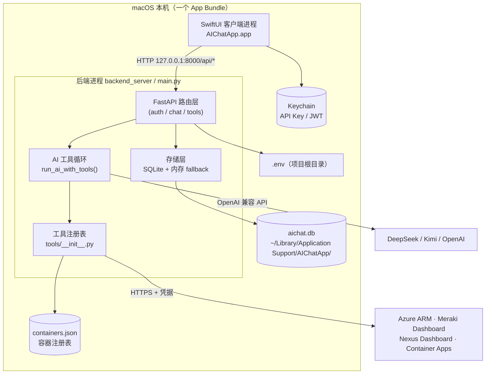
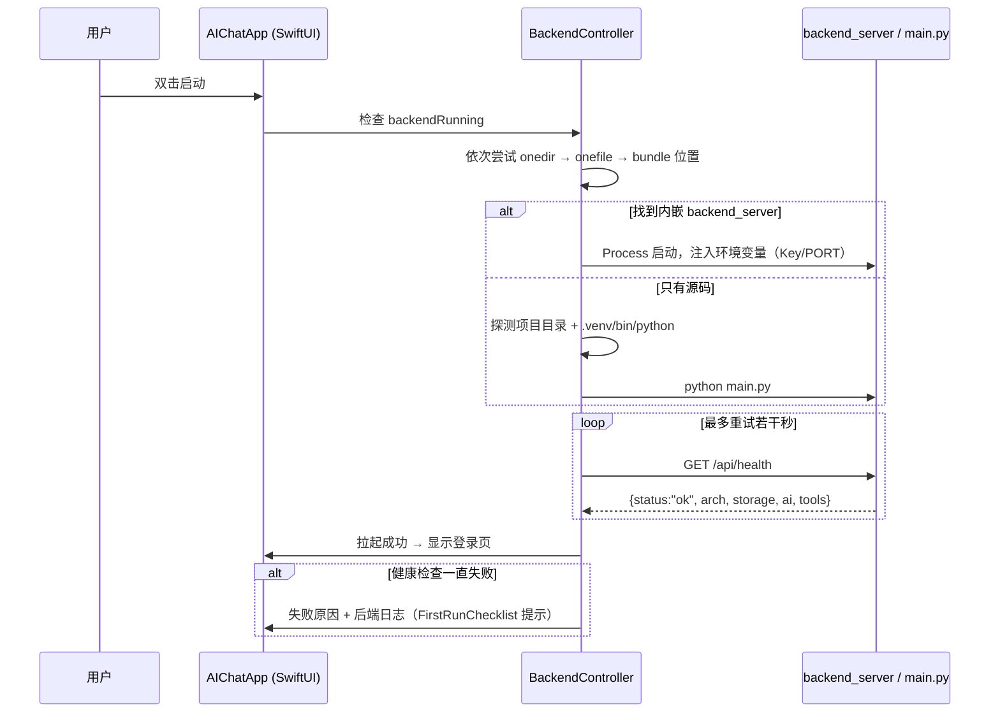
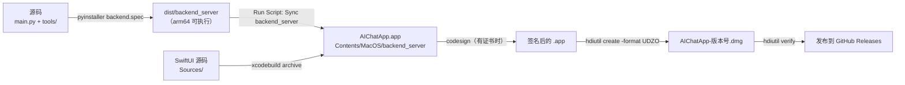

# AIChatApp 架构与工作流程说明

> 本文档给**开发者**看：讲清楚这个 App 由哪些部分组成、一次对话在系统里怎么流动、
> 工具是怎么挂上去的、数据落在哪里、以及从源码到 DMG 的构建发布链路。
>
> 面向普通用户的安装使用说明见根目录 [`README.md`](../README.md)；
> 客户端细节见 [`AIChatApp/README.md`](../AIChatApp/README.md)。
>
> English version: [`ARCHITECTURE.en.md`](ARCHITECTURE.en.md)

---

## 目录

1. [一句话概述](#1-一句话概述)
2. [系统架构总览](#2-系统架构总览)
3. [组件职责](#3-组件职责)
4. [目录结构逐项说明](#4-目录结构逐项说明)
5. [运行时工作流程](#5-运行时工作流程)
6. [工具子系统](#6-工具子系统)
7. [数据存储与配置](#7-数据存储与配置)
8. [认证与安全模型](#8-认证与安全模型)
9. [构建与发布流程](#9-构建与发布流程)
10. [测试矩阵](#10-测试矩阵)
11. [常见开发任务](#11-常见开发任务)
12. [已知不一致与技术债](#12-已知不一致与技术债)
13. [附录：接口与关键常量](#13-附录接口与关键常量)

---

## 1. 一句话概述

AIChatApp 是一个**完全跑在本机**的 AI 运维工作台：

- **前台**是原生 macOS SwiftUI 客户端（`AIChatApp.app`）；
- **后台**是同机运行的 FastAPI 服务（`main.py` 或打包后的 `backend_server`）；
- 两者只通过 `http://127.0.0.1:8000/api/*` 通信；
- 模型通过 **function calling** 调用 101 个只读运维工具，直接查 Azure / Meraki /
  Cisco Nexus Dashboard / Serverless 容器 / DeepSeek 余额；
- AI Provider 的 Key 只存在本地 `.env` 与 macOS Keychain 里，不出机器。

设计上的三条硬约束：

| 约束 | 落地方式 |
|---|---|
| **只支持 Apple Silicon 原生 arm64** | `main.py` 启动时检测 Rosetta 并拒绝运行；`backend.spec` / `build_dmg.sh` 硬校验架构 |
| **本地优先、不依赖云端** | 后端默认只绑定 `127.0.0.1`；SQLite 落盘；后端进程由客户端直接拉起 |
| **接口契约向后兼容** | 保留旧版 Azure Functions 的路径与响应结构（`chat_async` + `ai_task_status` 轮询） |

---

## 2. 系统架构总览

### 2.1 进程与网络拓扑



### 2.2 分层视图

```
┌────────────────────────────────────────────────────────────────────┐
│ 表现层  AIChatApp/Sources/Views/        RootView / LoginView /      │
│                                        ChatView / SettingsView      │
├────────────────────────────────────────────────────────────────────┤
│ 状态层  ViewModels/ + Services/         ChatViewModel 负责轮询；     │
│                                        SessionStore 管全局状态；    │
│                                        AppSettings 管 UserDefaults  │
├────────────────────────────────────────────────────────────────────┤
│ 传输层  Services/APIClient.swift        login / chat_async /        │
│                                        ai_task_status / 会话管理     │
├──────────────────────── HTTP (127.0.0.1) ──────────────────────────┤
│ 路由层  main.py @app.post/get           13 个 REST 端点              │
├────────────────────────────────────────────────────────────────────┤
│ 编排层  run_ai_with_tools()             多轮 function calling 循环  │
├────────────────────────────────────────────────────────────────────┤
│ 能力层  tools/*.py                     101 个工具（5 个分组）        │
├────────────────────────────────────────────────────────────────────┤
│ 存储层  SQLite conversations/tasks      + 内存 fallback             │
└────────────────────────────────────────────────────────────────────┘
```

---

## 3. 组件职责

| 组件 | 位置 | 职责 |
|---|---|---|
| **SwiftUI 客户端** | `AIChatApp/Sources/` | 登录、对话、设置三个页面；负责在缺少内嵌后端时**拉起本地 Python 后端** |
| **BackendController** | `AIChatApp/Sources/Services/BackendController.swift` | 定位 `backend_server`（onedir > onefile > 项目 `main.py`）、起停进程、`/api/health` 健康检查、依赖自检、日志收集、孤儿进程清理 |
| **APIClient** | `AIChatApp/Sources/Services/APIClient.swift` | 唯一 HTTP 出口，封装 13 个端点，统一带 JWT |
| **ChatViewModel** | `AIChatApp/Sources/ViewModels/ChatViewModel.swift` | 提交 `chat_async` → **每 2 秒**轮询 `ai_task_status` → 渲染工具调用日志 |
| **AppSettings** | `AIChatApp/Sources/Services/AppSettings.swift` | 后端地址、凭据、语言/字号；写 UserDefaults、Keychain，可选回写 `.env` |
| **FastAPI 后端** | `main.py`（2802 行） | 路由、鉴权、AI 编排、工具循环、SQLite 持久化 |
| **工具注册表** | `tools/__init__.py` | `default_schemas()` / `execute_tool()` / `health()` 三个入口，统一分发到 5 个模块 |
| **工具模块** | `tools/{azure,meraki,nexus_dashboard,container,ai}_tools.py` | 每个模块导出 `SCHEMAS` / `TOOL_NAMES` / `execute()` / `health()` |
| **历史实现** | `function_app.py`（263 KB） | 旧 Azure Functions 版本，**仅作参考，运行时不被引用** |
| **打包脚本** | `backend.spec`、`AIChatApp/scripts/build_dmg.sh`、`scripts/arm64_native.sh` | 后端 PyInstaller 打包、客户端 archive + 签名 + DMG、arm64 硬校验 |

---

## 4. 目录结构逐项说明

```
MyMacApp/
├── main.py                       # ★ 后端唯一正式实现：路由 + AI 编排 + 工具循环 + 存储
├── tools/                        # ★ AI 可调用的工具集（注册表模式）
│   ├── __init__.py               #   MODULES 字典 + default_schemas/execute_tool/health
│   ├── azure_tools.py            #   21 个 Azure 工具（DefaultAzureCredential + ARM REST）
│   ├── meraki_tools.py           #   45 个 Meraki 工具（httpx 直连 Dashboard REST）
│   ├── nexus_dashboard_tools.py  #   31 个 Nexus Dashboard 工具（Infra API + Manage API，只读）
│   ├── container_tools.py        #    3 个 Serverless 容器工具（注册表驱动 + 热加载）
│   └── ai_tools.py               #    1 个 AI 工具（DeepSeek 余额）
├── function_app.py               # 【历史】原 Azure Functions 实现，仅参考
├── requirements-fastapi.txt      # 后端依赖清单
├── .env.example                  # 环境变量模板（含全部可配置项与注释）
├── backend.spec                  # PyInstaller 打包配置（默认 onefile；PYI_ONEDIR=1 出目录版）
├── scripts/
│   ├── arm64_native.sh           # "必须原生 arm64" 的公共校验函数（被其它脚本 source）
│   ├── run_native_arm64.sh       # 用原生 arm64 Python 跑后端
│   └── verify_backend_binary.py  # 打包产物端到端验证（起进程 + 打接口 + 查架构）
├── test_*.py                     # 8 个 unittest 测试（见 §10）
├── AIChatApp/                    # ★ macOS SwiftUI 客户端（Xcode 工程）
│   ├── AIChatApp.xcodeproj/      #   Xcode 工程 + shared scheme
│   ├── Sources/
│   │   ├── AIChatAppApp.swift    #   @main 入口，装配全局环境对象
│   │   ├── Models/               #   APIModels / ToolCallLog / AppLanguage / SettingsSection
│   │   ├── Services/             #   APIClient / BackendController / AppSettings /
│   │   │                         #   KeychainStore / SessionStore / Localization*
│   │   ├── ViewModels/           #   ChatViewModel / ConnectionTester / FirstRunChecklist
│   │   └── Views/                #   Root / Login / Chat / Settings / Components /
│   │                             #   FirstRunChecklistView / AppTypography
│   ├── Assets.xcassets/          #   App 图标
│   ├── Support/Info.plist        #   含 NSAllowsLocalNetworking（放行 127.0.0.1）
│   ├── scripts/                  #   build_dmg.sh（archive→签名→DMG）、make_icons.swift
│   └── README.md                 #   客户端详细文档
├── README.md                     # 用户向总说明
├── SECURITY.md                   # 安全策略
├── LICENSE                       # MIT
└── docs/ARCHITECTURE.md          # ← 本文档
```

**运行期数据（不入库，见 `.gitignore`）**

| 路径 | 内容 |
|---|---|
| `~/Library/Application Support/AIChatApp/aichat.db` | SQLite：会话历史 + 异步任务 |
| `~/Library/Application Support/AIChatApp/containers.json` | Serverless 容器注册表 |
| `~/Library/Logs/AIChatApp/backend.log` | 内嵌后端日志 |
| 项目根 `.env` | 本机配置与 Key（**绝不提交**） |
| `dist/`、`build/`、`*.dmg`、`AIChatApp/Resources/backend_server/` | 构建产物 |

---

## 5. 运行时工作流程

### 5.1 启动流程（App 冷启动）



细节：

- 后端启动时 `_enforce_native_arm64()` 先于第三方 import 执行，被 Rosetta 翻译时给出中文提示并退出
  （`ALLOW_ROSETTA=true` 可逃生）。
- `lifespan` 里做两件事：打印架构报告、按 CPU 数调整 Starlette 线程池。
- `_init_storage()` 建 `conversations` / `tasks` 两张表；失败则降级内存模式，**服务照常起**。

### 5.2 登录流程（三条路径）

| 路径 | 流程 | 需要的配置 |
|---|---|---|
| **本地管理员**（应急） | `POST /api/login` 校验 `ADMIN_USERNAME`/`ADMIN_PASSWORD` → 签发 JWT | 无（有默认值） |
| **Google OAuth** | `POST /auth/google/start` 返回授权 URL（Authorization Code + **PKCE**）→ 系统浏览器授权 → `GET /auth/google/callback` 校验 state 与邮箱白名单 → 页面显示成功 → 客户端轮询 `GET /auth/google/status` 领取 JWT | `GOOGLE_CLIENT_ID`（+ 可选 `GOOGLE_ALLOWED_EMAILS/DOMAINS`） |
| **GitHub Device Flow** | `POST /auth/github/start` 返回 `user_code`（App 自动复制到剪贴板并打开 `github.com/login/device`）→ 客户端轮询 `GET /auth/github/status`，后端向 GitHub 换 token、读身份、校验白名单 → 返回后端 JWT | `GITHUB_CLIENT_ID`（+ 可选 `GITHUB_ALLOWED_LOGINS/EMAILS`） |

三条路径最终**都签发同一个后端 JWT**（HS256，默认 24 小时），客户端把 token 存进 Keychain。
Google access token 只在后端短暂用于读身份，落不到客户端。

鉴权入口是 FastAPI 依赖 `require_auth()`：优先 `Authorization: Bearer <JWT>`，
失败时回退 `X-MS-CLIENT-PRINCIPAL`（兼容旧 Easy Auth 部署），都不行抛 401。

### 5.3 一次对话的完整时序（核心流程）

```mermaid
sequenceDiagram
    autonumber
    participant U as 用户
    participant CV as ChatViewModel
    participant API as APIClient
    participant BE as main.py
    participant LOOP as run_ai_with_tools
    participant T as tools/*
    participant DB as SQLite
    participant LLM as DeepSeek / Kimi

    U->>CV: 输入 prompt，点发送
    CV->>API: POST /api/chat_async {prompt, enable_tools, conversation_id}
    API->>BE: （Bearer JWT）
    BE->>BE: require_auth() → _create_task() 落库 status=pending
    BE-->>API: 202 {instance_id}
    BE->>BE: BackgroundTask → _run_chat_task(instance_id, payload)

    par 客户端轮询
        loop 每 2 秒
            CV->>API: GET /api/ai_task_status?instance_id=...
            API->>BE: 查询 tasks 表
            BE-->>API: {status: pending|running|completed|failed}
        end
    and 后端执行
        BE->>BE: build_chat_messages()（拼系统提示 + 历史 + 图片/文件上下文）
        BE->>LOOP: messages, tools="default"
        loop 最多 MAX_TOOL_ITERATIONS(15) 轮
            LOOP->>LLM: chat.completions.create(messages, tools)
            LLM-->>LOOP: 文本 或 tool_calls
            alt 有 tool_calls
                LOOP->>LOOP: 同轮去重 + 签名计数（防死循环）
                LOOP->>T: execute_tool(name, args)
                T-->>LOOP: JSON 字符串结果
                LOOP->>LOOP: 追加 role=tool 消息，继续下一轮
            else 纯文本
                LOOP-->>BE: {response, tool_calls_log, stop_reason}
            end
        end
        BE->>DB: _save_conversation()（助手消息 + 工具日志一起落库）
        BE->>DB: _update_task(status=completed)
    end
    CV->>CV: 轮询到 completed → 渲染气泡 + 工具调用折叠面板
```

**关键点**

- `chat_async` 立刻返回 `instance_id`（HTTP 202），真正的执行放在 Starlette 线程池
  （`_run_chat_task` 是同步函数，不阻塞事件循环）。同步入口 `POST /api/chat` 也保留，
  最大 360 秒（`AI_REQUEST_TIMEOUT_SECONDS`）。
- 请求体里 `prompt`（单轮）与 `messages`（多轮）二选一；
  `enable_tools: true` 才把 101 个 schema 挂给模型（默认值可由 `TOOLS_ENABLED_BY_DEFAULT` 改）。
- 历史消息在发给模型前会过一遍 `_sanitize_history()`，剥掉 `tool_calls_log` 等自定义字段。
- 带图片且 Provider 是 DeepSeek 时，自动切到视觉模型（`DEEPSEEK_VISION_MODEL_NAME`）。
- 每次模型调用都记 `usage`，`/api/health` 里能看到累计统计。

### 5.4 工具循环「停不下来」时的优雅收尾

旧版行为是抛异常「超过最大轮次」，现在是**三种停因都能给出最终答案**：

| 停因 `stop_reason` | 触发条件 | 处理 |
|---|---|---|
| `completed` | 模型直接给出文本回复 | 正常返回 |
| `iteration_limit` | 达到 `MAX_TOOL_ITERATIONS`（默认 15，可按请求覆盖，上限 50） | 再发一次**不带工具**的请求收尾 |
| `repeated_tool_calls` | 同一 `(工具名, 参数)` 已执行 `MAX_IDENTICAL_TOOL_CALLS`（默认 2）次 | 同上，且后续同签名调用不再执行 |

收尾请求若也失败，则退化为 `_fallback_tool_summary()` —— 把已跑过的工具结果拼成摘要，
保证用户至少看到「查到了什么、卡在哪一步」。另外：同一轮里完全相同的调用只执行一次（结果复用），
同一工具连续失败 `MAX_TOOL_ERRORS_BEFORE_NOTICE`（默认 3）次后，工具结果会追加「别再重试它」提示。

### 5.5 会话持久化

- 会话以 `conversation_id` 为键存进 `conversations` 表（`id / title / messages / updated_at / message_count`），
  `messages` 是完整 JSON 数组，**助手消息里带 `tool_calls_log`**，所以历史记录里也能回看工具调用。
- 标题由 `_derive_title()` 从首条用户消息自动生成。
- 侧边栏走 `GET /api/chat_conversations`（不含正文，按更新时间倒序），点开走
  `GET /api/chat_history`，删除走 `DELETE /api/chat_conversation`。
- 异步任务存 `tasks` 表；每次查询都会用 `TASK_TTL_HOURS`（默认 24h）清理过期记录。
- 存储层「一次操作一个连接」+ WAL 模式，多线程/多 worker 安全；要换 Postgres 时，
  替换点集中在 `main.py` 的「存储层」一节。

### 5.6 设置页写入链路

```
用户在设置页填 Key
   └─▶ KeychainStore（钥匙串）
   └─▶ 可选：合并写回项目根 .env（保留其它已有行）
   └─▶ 重启后端进程时以环境变量注入：DEEPSEEK_API_KEY / KIMI_API_KEY /
       DEFAULT_AI_PROVIDER / AI_MOCK_MODE / PORT
环境变量优先级 > .env 文件（已存在的系统变量不会被 .env 覆盖）
```

容器 API Key 是例外中最方便的一条：写进 Keychain 的同时**回写 `containers.json`**，
后端每次调用都重读注册表 → **改完立即生效，不用重启**。

---

## 6. 工具子系统

### 6.1 注册表机制

`tools/__init__.py` 只用三个函数对外，`main.py` 不关心具体有哪些工具：

```python
MODULES = {"azure", "meraki", "nexus_dashboard", "container", "ai"}  # 顺序 = schema 顺序

default_schemas()   -> list[dict]      # 直接喂给 OpenAI SDK 的 tools 参数（共 101 个）
execute_tool(name, arguments) -> str|None   # JSON 字符串；None = 未注册；失败固定 {"status":"error",...}
health()            -> dict            # 各分组凭据/依赖状态，供 /api/health 使用
```

新增一个工具模块的标准做法：

1. 新建 `tools/xxx_tools.py`，导出 `SCHEMAS`（OpenAI function schema 列表）、
   `TOOL_NAMES`、`execute(name, arguments) -> str`、`health() -> dict`；
2. 在 `tools/__init__.py` 的 `MODULES` 里加一行；
3. **不需要改 `main.py`** —— 工具的 schema 会自动挂载，`execute_tool` 会自动分发。

注意：`SCHEMAS` / `ENDPOINTS` / `TOOL_SPECS` 在 `meraki_tools.py` 里是三张平行表，改需求要同步改。

### 6.2 工具分组

| 分组 | 数量 | 传输/认证方式 | 说明 |
|---|---|---|---|
| **Azure** | 21 | `DefaultAzureCredential`（服务主体或 CLI）+ ARM REST | 订阅/资源组、VM 与 CPU 指标、VNet/子网/NSG、Storage/Web/SQL/KeyVault/AKS/ACI 清点、KQL `query_resources`、监控指标 |
| **Meraki** | 45 | `X-Cisco-Meraki-API-Key`（OAuth 时 `MERAKI_AUTH_HEADER=bearer`），httpx 直连 | 组织/网络/设备、VPN、上联、Appliance（VLAN/端口/路由/L3·L7 防火墙/NAT/端口转发/IPS/内容过滤/流量整形）、交换机端口与镜像、无线 SSID/RF |
| **Nexus Dashboard** | 31 | API Key（`X-Nd-Username`+`X-Nd-Apikey`）或用户名密码换 token（进程内缓存 10 分钟、401 自动重登） | 官方 Infra API 17 + Manage API 13 + 聚合视图 `nexus_overview` 1。**全部只读 GET** |
| **Serverless 容器** | 3 | 注册表 + `X-API-Key` | `container_list_endpoints` / `container_list_tasks` / `container_run_task`，白名单驱动 |
| **AI** | 1 | `DEEPSEEK_API_KEY` | `deepseek_get_balance` 查余额 |

### 6.3 容器工具的注册表与白名单

配置来源优先级（`registry_entries()`）：

```
1) 环境变量 CONTAINER_ENDPOINTS_JSON      （内联 JSON，便于 CI/测试）
2) 注册表文件 AICHAT_CONTAINERS_FILE 或
   ~/Library/Application Support/AIChatApp/containers.json   ← 每次调用都重读，改完立即生效
3) 旧配置兼容：ANSIBLE_EXECUTOR_URL + ANSIBLE_EXECUTOR_API_KEY → 合成一个名为 ansible 的条目
```

密钥来源（`key_source` 字段可查）：App 设置页写 Keychain + 回写注册表 > 直接写注册表 `api_key`
> `api_key_env`/`AICHAT_CONTAINER_KEY_<名字大写>` 环境变量（此时改 key 需重启）。

调用白名单判定（`mode: auto`，默认）：`allowed_tasks` 显式放行 → 容器 `GET /tasks` 标了
`read_only: true` 的自动放行 → 回退内置只读名单。**写操作默认一律拦截**；
容器里能执行任意 playbook 的 `POST /run-ansible` 故意不暴露给模型（等价于容器内任意代码执行）。

---

## 7. 数据存储与配置

### 7.1 SQLite 表结构

```sql
CREATE TABLE IF NOT EXISTS conversations (
    id            TEXT PRIMARY KEY,   -- conversation_id
    title         TEXT,               -- 由首条用户消息派生
    messages      TEXT,               -- 完整消息数组（JSON），含 tool_calls_log
    updated_at    TEXT,               -- 带微秒的 UTC ISO8601
    message_count INTEGER
);

CREATE TABLE IF NOT EXISTS tasks (
    instance_id TEXT PRIMARY KEY,     -- chat_async 返回的实例 ID
    status      TEXT,                 -- pending / running / completed / failed
    result      TEXT,                 -- 成功结果 JSON
    error       TEXT,                 -- 失败原因
    created_at  TEXT,
    updated_at  TEXT
);
```

### 7.2 环境变量

完整清单带注释见 [`.env.example`](../.env.example)，最关键的几组：

| 变量 | 作用 |
|---|---|
| `DEEPSEEK_API_KEY` / `KIMI_API_KEY` / `OPENAI_API_KEY` | AI Provider；**全空则进 mock 模式** |
| `DEFAULT_AI_PROVIDER` / `AI_MOCK_MODE` | 默认 Provider；`auto`=有 Key 就真调、没 Key 就 mock |
| `JWT_SECRET` / `ADMIN_USERNAME` / `ADMIN_PASSWORD` | **生产必须改掉默认值** |
| `GOOGLE_CLIENT_ID` / `GITHUB_CLIENT_ID` | 第三方登录开关 |
| `AZURE_*` / `MERAKI_API_KEY` / `ND_*` | 各工具分组凭据 |
| `HOST` / `PORT` / `API_PREFIX` / `LOG_LEVEL` | 服务监听（`HOST` 默认 `127.0.0.1`） |
| `AICHAT_DB_PATH` / `AICHAT_CONTAINERS_FILE` | 数据文件位置 |
| `MAX_TOOL_ITERATIONS` / `MAX_IDENTICAL_TOOL_CALLS` / `TOOLS_ENABLED_BY_DEFAULT` | 工具循环行为调优 |

---

## 8. 认证与安全模型

**边界假设**：后端只监听 `127.0.0.1`，能被访问就说明攻击者已经在本机有代码执行能力；
因此这里的防护重点是**避免误暴露**与**避免密钥泄漏**，而不是抗公网攻击。

| 面 | 措施 |
|---|---|
| 网络 | 默认绑定 `127.0.0.1`（要局域网访问必须显式 `HOST=0.0.0.0`）；客户端 `Info.plist` 只放行本地网络 |
| 鉴权 | 除 `/api/login`、`/api/auth/*`、`/api/health` 外全部要求 Bearer JWT；OAuth 使用 PKCE / Device Flow，客户端不持有第三方 secret |
| 授权 | Google 可配邮箱/域名白名单，GitHub 可配用户名/邮箱白名单；两项为空时**默认放开**（自用场景） |
| 凭据存放 | Key 存 Keychain；`.env` 权限受限；容器注册表文件权限 0600 |
| 密钥不入库 | `.gitignore` 覆盖 `.env*`、`*.pem`、`*.key`、`*.db`、构建产物、`CODEX_HANDOFF.md` |
| 工具最小权限 | 所有运维工具**只读**；容器工具默认拦写操作；`POST /run-ansible` 不暴露 |
| 历史脱敏 | `function_app.py` 入库前已把租户/订阅 GUID、Key Vault 端点、内网命名替换为占位符 |

更多见 [`SECURITY.md`](../SECURITY.md)。

---

## 9. 构建与发布流程

### 9.1 从源码到可分发 DMG 的完整链路



### 9.2 后端打包

```bash
.venv/bin/pyinstaller backend.spec --clean          # onefile → dist/backend_server
PYI_ONEDIR=1 .venv/bin/pyinstaller backend.spec --clean   # onedir，冷启动快约 20 倍
```

- `backend.spec` 固定 `TARGET_ARCH=arm64`（可用 `PYI_TARGET_ARCH` 覆盖）；
- 手工列 `uvicorn` 的 hiddenimports；`azure-*` SDK 用 `collect_submodules` 递归收集；
- `console=False`：作为后台进程拉起，不弹终端窗口；
- 客户端优先加载 onedir（`Contents/Resources/backend_server/backend_server`），其次 onefile。

### 9.3 客户端出 DMG

```bash
AIChatApp/scripts/build_dmg.sh          # 产物：AIChatApp/AIChatApp-<版本>.dmg
```

脚本步骤：清理旧产物 → `xcodebuild archive`（Release）→ 从 archive 取 `.app` →
同步 `dist/backend_server` → 找 `Developer ID Application` 证书签名（找不到就警告并跳过，
`SKIP_CODESIGN=1` 可强制跳过）→ `hdiutil create UDZO` → `hdiutil verify`。
DMG 内容 = `AIChatApp.app` + `Applications` 快捷方式 + `README.txt`。

### 9.4 arm64 硬约束

`scripts/arm64_native.sh` 提供公共校验：在 Rosetta 终端里跑打包脚本会**直接拒绝**
（`AICHAT_ARM64_OVERRIDE=1` 仅供自动化）。打包产物还会被 `lipo -archs` 硬校验。
可用 `scripts/verify_backend_binary.py` 做端到端验证（起进程、打接口、查架构）。

### 9.5 发布

当前**没有 CI 配置**（仓库里没有 `.github/workflows/`）：构建与发版都在本地完成，
把 DMG 挂到 GitHub Releases（`https://github.com/gtsdrt/gtsdrt_ai_hub_macos/releases`），
建议同时公布 SHA-256 供用户核对。

---

## 10. 测试矩阵

全部是 `unittest`，可直接运行，默认不发真实网络请求（工具测试走 mock）：

```bash
.venv/bin/python test_storage.py                # SQLite 持久化 / 降级
.venv/bin/python test_tool_loop.py              # 工具循环、防死循环、优雅收尾
.venv/bin/python test_azure_tools.py            # Azure 21 个工具
.venv/bin/python test_meraki_tools.py           # Meraki 45 个工具
.venv/bin/python test_nexus_dashboard_tools.py  # Nexus Dashboard 31 个工具
.venv/bin/python test_container_tools.py        # 容器注册表 / 白名单 / 热加载
.venv/bin/python test_google_auth.py            # Google OAuth + PKCE
.venv/bin/python test_github_auth.py            # GitHub Device Flow
```

| 测试文件 | 覆盖点 |
|---|---|
| `test_storage.py` | 建表、会话读写、任务 TTL、内存 fallback |
| `test_tool_loop.py` | 轮次上限、同签名重复调用、轮内去重、收尾摘要、`stop_reason` |
| `test_azure_tools.py` / `test_meraki_tools.py` / `test_nexus_dashboard_tools.py` | schema 完整性、参数校验、错误结构统一为 `{"status":"error"}` |
| `test_container_tools.py` | 注册表解析（三种来源）、白名单判定、Key 来源优先级 |
| `test_google_auth.py` / `test_github_auth.py` | state/TTL、白名单、token 交换、状态码分支 |

---

## 11. 常见开发任务

| 想做的事 | 怎么做 |
|---|---|
| **加一个运维工具** | 新建/修改 `tools/xxx_tools.py` 的 `SCHEMAS`+`TOOL_NAMES`+`execute`，必要时在 `tools/__init__.py` 的 `MODULES` 注册；补一个 `test_*.py` |
| **换 AI Provider 或模型** | 改 `_provider_settings()` 里的 `base_url`/`model`，或用环境变量覆盖（`*_MODEL_NAME`、`*_BASE_URL`） |
| **加一个 REST 端点** | 在 `main.py` 加 `@app.post(f"{API_PREFIX}/xxx")`，需要鉴权的加 `Depends(require_auth)`；客户端在 `APIClient.swift` 加对应方法 |
| **界面加文案** | 三套语言表同在 `Services/`：`Localization.swift` + `LocalizationTableEN.swift` + `LocalizationTableNB.swift`，**三处都要加** |
| **界面字号** | 用 `.appFont(.body)` 而不是 `.font(.body)`，自动跟随 ⌘+/⌘− 缩放 |
| **改存储/换数据库** | 集中在 `main.py`「3. 存储层」一节（`_db()` / `_init_storage()` / `_save_conversation()` 等） |
| **调试后端接口** | `python main.py` 后开 `http://127.0.0.1:8000/docs`（Swagger UI） |
| **看内嵌后端日志** | `~/Library/Logs/AIChatApp/backend.log`，或设置页里的「后端日志」 |
| **只改客户端 UI** | `xcodebuild -project AIChatApp/AIChatApp.xcodeproj -scheme AIChatApp -configuration Debug -derivedDataPath .xcbuild build` |

**排错优先级**：先看 `/api/health`（架构 / 存储 / Key 配置 / 各工具组凭据状态一屏可见）
→ 再看后端日志 → 最后查具体工具分组的 `health()` 字段。

---

## 12. 已知不一致与技术债

写这份文档时对照代码发现的问题，建议顺手修（不影响功能）：

1. **README 安全说明与实际默认值矛盾**：README 末尾写「后端默认监听 `0.0.0.0:8000`」，
   但 `main.py` 现在默认 `127.0.0.1`（commit `7a25d73` 改为安全默认），README 未同步。
2. **`main.py` 文档字符串过期**：`run_ai_with_tools()` 的 docstring 写「默认 `MAX_TOOL_ITERATIONS=10`」，
   实际常量是 15。
3. **`AIChatApp/README.md` 版本号过期**：文中写「当前 `0.2.2`」，实际 `MARKETING_VERSION` 已到 `0.2.6`。
4. **`function_app.py` 仍在仓库里**（263 KB、已脱敏、不被引用）：作为历史参考可以留，
   建议在文件头加一句「仅供考古，新功能一律加到 `main.py`」以免误导新同学。
5. **没有 CI**：测试与 arm64 校验都靠本地脚本，容易漏。可加一个 GitHub Actions
   （macOS runner）跑 `test_*.py` 与 `lipo` 架构校验。

---

## 13. 附录：接口与关键常量

### 13.1 REST 接口一览

| 方法 | 路径 | 鉴权 | 说明 |
|---|---|---|---|
| `POST` | `/api/login` | — | 本地管理员登录，签发 JWT |
| `POST` | `/api/auth/google/start` | — | 发起 Google OAuth（Authorization Code + PKCE） |
| `GET` | `/api/auth/google/callback` | — | Google 浏览器回调（HTML 页面） |
| `GET` | `/api/auth/google/status` | — | 轮询领取后端 JWT |
| `POST` | `/api/auth/github/start` | — | 发起 GitHub Device Flow |
| `GET` | `/api/auth/github/status` | — | 轮询设备授权并领取 JWT |
| `GET` | `/api/health` | — | 健康检查（架构/存储/AI/各工具组凭据） |
| `POST` | `/api/test_connection` | ✅ | 测 `azure`/`meraki`/`nexus_dashboard`/`container`/`deepseek` 连通性 |
| `POST` | `/api/chat` | ✅ | 同步对话（最长 360s） |
| `POST` | `/api/chat_async` | ✅ | 异步对话，返回 `instance_id`（202） |
| `GET` | `/api/ai_task_status` | ✅ | 轮询异步任务结果 |
| `GET` | `/api/chat_history` | ✅ | 读单个会话消息（含工具调用日志） |
| `GET` | `/api/chat_conversations` | ✅ | 会话列表（侧边栏） |
| `DELETE` | `/api/chat_conversation` | ✅ | 删除会话 |

错误响应统一为 `{"error": "..."}`（由 `http_exception_handler` 保证）。

### 13.2 关键常量（`main.py`）

| 常量 | 默认值 | 环境变量 |
|---|---|---|
| 监听地址 / 端口 | `127.0.0.1:8000` | `HOST` / `PORT` |
| API 前缀 | `/api` | `API_PREFIX` |
| JWT 有效期 | 1440 分钟（24h） | `JWT_EXPIRATION_MINUTES` |
| 工具轮次上限 | 15（请求可覆盖，夹在 1–50） | `MAX_TOOL_ITERATIONS` |
| 同签名调用上限 | 2 | `MAX_IDENTICAL_TOOL_CALLS` |
| 同工具连续失败提示阈值 | 3 | `MAX_TOOL_ERRORS_BEFORE_NOTICE` |
| 工具结果预览长度 | 500 字符 | `TOOL_RESULT_PREVIEW_CHARS` |
| 异步任务保留 | 24 小时 | `TASK_TTL_HOURS` / `TASK_TTL_SECONDS` |
| AI 请求超时 | 360 秒 | `AI_REQUEST_TIMEOUT_SECONDS` |
| 单次最多图片 / 文件 / 文件字符 | 5 / 5 / 50000 | `MAX_CHAT_IMAGES` / `MAX_CHAT_FILES` / `MAX_FILE_CHARS` |
| 默认 Provider | `deepseek` | `DEFAULT_AI_PROVIDER` |
| mock 模式 | `auto` | `AI_MOCK_MODE` |
| 客户端轮询间隔 | 2 秒 | `ChatViewModel.pollIntervalNanoseconds`（客户端常量） |

### 13.3 当前版本

`0.2.6`（`AIChatApp` 工程的 `MARKETING_VERSION`，对应 `CFBundleVersion 8`）。
