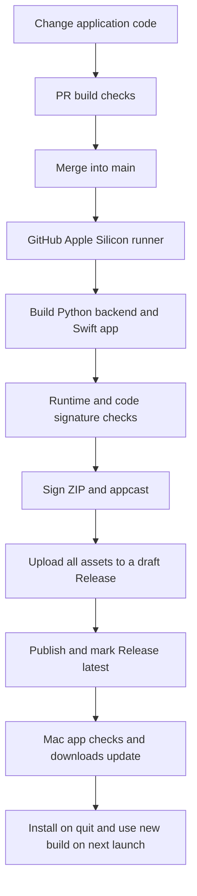

# AIChatApp Automatic Releases, Deployment, and Updates

[中文版](AUTO_UPDATE.md) · [Architecture](ARCHITECTURE.en.md) · [Project README](../README.md)

New feature guide: [Encrypted backup and restore](ENCRYPTED_BACKUP.en.md).

Recorded on 2026-10-01. This guide documents the released **0.3.4** build and the automatic release and update workflow implemented in this repository.

## Contents

1. [Changes and validation record](#1-changes-and-validation-record)
2. [Deployment model and requirements](#2-deployment-model-and-requirements)
3. [Users: installation and initial configuration](#3-users-installation-and-initial-configuration)
4. [Maintainers: configuring GitHub releases](#4-maintainers-configuring-github-releases)
5. [Changing code and publishing releases](#5-changing-code-and-publishing-releases)
6. [Users: automatic and manual updates](#6-users-automatic-and-manual-updates)
7. [Local development and release validation](#7-local-development-and-release-validation)
8. [Signing, notarization, and key maintenance](#8-signing-notarization-and-key-maintenance)
9. [Troubleshooting and recovery](#9-troubleshooting-and-recovery)
10. [Files and references](#10-files-and-references)

## 1. Changes and validation record

Previously, releasing the app required building the Python backend and macOS client locally and uploading the installation package manually. Application changes on the main branch now trigger GitHub Actions to build and publish releases. An installed app with the updater obtains new versions from GitHub.

| Change | Implemented behavior |
| --- | --- |
| Sparkle 2.10.0 | Pinned through Swift Package Manager; handles checking, downloading, verification, and app replacement |
| Update controls | App menu has “Check for Updates…”; settings has “Software Updates,” with Chinese, English, and Norwegian translations |
| Initial update policy | Checks hourly and downloads automatically; installation on quit can require confirmation depending on permissions and signing |
| Update scope | Replaces the entire `.app`, including the Swift client and bundled Python backend |
| GitHub Actions | An Apple Silicon runner builds the backend, app, DMG, ZIP, and signed `appcast.xml` |
| Version management | Generates the display version, build number, and release tag automatically |
| Update verification | Ed25519 signatures for the feed and ZIP; archive verification before extraction |
| Framework packaging | Thins Sparkle and helpers to arm64 and signs nested code from inside out, preserving helper entitlements |
| Runtime validation | Checks the packaged backend's health/shutdown, app signatures, and initialization of the packaged updater |
| First-launch guidance | The Release page explains Gatekeeper's Privacy & Security → Open Anyway procedure |

First production release:

- [Feature PR #1](https://github.com/gtsdrt/gtsdrt_ai_hub_macos/pull/1), merged as `4ad2de7a8036c5f1669bdd42fc58be361a604045`.
- The [production workflow run](https://github.com/gtsdrt/gtsdrt_ai_hub_macos/actions/runs/36899106196) succeeded.
- [Release 0.3.4](https://github.com/gtsdrt/gtsdrt_ai_hub_macos/releases/tag/v0.3.4-build.1), build `10.4.1`, contains a DMG, ZIP, and `appcast.xml`.
- Post-release checks downloaded the published ZIP/feed and verified the live update URL, versions, size, Ed25519 signatures, app code signatures, and agreement with the committed public key.
- Local checks rejected a modified ZIP and an incorrect build number. The user confirmed that the installed app opens on this Mac.

These checks cover building, publishing, signatures, and first launch. A user-level acceptance test that replaces an older 0.3 installation with a later 0.3 build has not yet been completed.

### Large-font input field fix (2026-10-02)

Released in [0.3.6 (build 10.6.1)](https://github.com/gtsdrt/gtsdrt_ai_hub_macos/releases/tag/v0.3.6-build.1). [PR #2](https://github.com/gtsdrt/gtsdrt_ai_hub_macos/pull/2) and the [production release build](https://github.com/gtsdrt/gtsdrt_ai_hub_macos/actions/runs/36990546481) passed their checks. The actual published ZIP/feed were downloaded again to verify versions, size, the Ed25519 signature, and the app's code signature.

To address text overflowing Settings fields at 200% font scale, Settings, container keys, and login now share input controls sized from the font's actual line height. Text, placeholders, and password bullets scale together with the field height. Settings labels have a wider column; when space is limited, the label moves above the editor so long labels such as `OPENAI_MODEL_NAME` do not crowd the input area.

Local validation includes a complete Xcode build and 32 native editor layout checks at 80%, 115%, 200%, and 250% font scale, with 560/940-point widths and font changes while running. The saved font preference is preserved. Use “Check for Updates…” to install a subsequent release containing this fix.

## 2. Deployment model and requirements

GitHub deploys downloadable macOS packages. The client and Python backend continue to run on each user's Mac; enabling updates does not move the backend to GitHub servers.



| Environment | Current requirements |
| --- | --- |
| User's Mac | macOS 13+, Apple Silicon / arm64; Intel and Rosetta are unsupported |
| Release installation | Python, Xcode, and backend dependencies do not need to be installed separately |
| Local development | Apple Silicon Mac, Xcode compatible with the current project, native arm64 Python, and Git |
| GitHub build | `macos-15` runner, Python 3.13 arm64, PyInstaller 6.x |
| Updater | Sparkle 2.10.0, pinned in both the Xcode project and workflow |
| Release hosting | GitHub Releases in the current public repository; GitHub Pages is unnecessary |
| Network | Users can access GitHub feeds and release downloads; the runner can download dependencies |
| First-install trust | Currently ad-hoc signed; Developer ID signing and Apple notarization are not integrated |

## 3. Users: installation and initial configuration

### 3.1 Download and install

1. Visit [latest Releases](https://github.com/gtsdrt/gtsdrt_ai_hub_macos/releases/latest) and download `AIChatApp-<version>.dmg`.
2. Open the DMG and drag `AIChatApp.app` into `/Applications`. Quit any running copy before replacing it.
3. Launch the app from Applications. Do not keep running it directly from the read-only DMG: the updater cannot replace an app there.
4. Configure administrator sign-in, your AI provider, and any operational tool credentials. Save and restart the backend when the UI requests it.

Versions `0.2.7` and earlier have no updater. Install a `0.3` release manually once. Users already running `0.3.4` do not need to reinstall that same version.

To check this production DMG:

```bash
shasum -a 256 ~/Downloads/AIChatApp-0.3.4.dmg
```

The GitHub release asset SHA-256 for the `0.3.4` DMG is:

```text
2004452a7e2d4e8a8eb17002e9512d0402c7294fb96d5cb7dd69bd65a5640437
```

This digest applies only to `v0.3.4-build.1`. Check each other release's own asset digest. A matching file hash does not establish Apple notarization.

### 3.2 Apple cannot verify the app on first launch

The current package lacks Developer ID signing and Apple notarization, so macOS may display:

> Apple could not verify “AIChatApp” is free of malware that may harm your Mac or compromise your privacy.

After confirming that the package comes from this project, follow [Apple's instructions](https://support.apple.com/en-us/102445):

1. Attempt to open the app and dismiss the blocking alert.
2. Open System Settings → Privacy & Security and locate the AIChatApp blocking notice.
3. Choose Open Anyway, confirm, and authenticate with your Mac login when prompted.
4. Open the app again. On newer macOS versions, right-click → Open alone may be insufficient.

During this deployment, the installed app's signature hash was matched to the published package before removing that app's download quarantine attribute. The user then confirmed it opens. This local action did not notarize the distributed package; other Macs may still need first-launch approval.

### 3.3 Runtime configuration and data locations

- The bundled backend defaults to `http://127.0.0.1:8000`. Enable “Start the local backend automatically” in settings.
- Configure administrator credentials and the AI provider in settings. Credentials are stored in Keychain and passed to the local backend through environment variables on launch.
- Configure Azure, Meraki, Nexus Dashboard, and container connections as needed. See the [architecture guide](ARCHITECTURE.en.md) and [client README](../AIChatApp/README.md) for other features.

| Data | Default location |
| --- | --- |
| Chat database | `~/Library/Application Support/AIChatApp/aichat.db`; overridable with `AICHAT_DB_PATH` |
| Backend PID file | `~/Library/Application Support/AIChatApp/backend.pid` |
| Backend log | `~/Library/Logs/AIChatApp/backend.log` |
| Non-sensitive preferences | UserDefaults; current bundle ID is `com.example.AIChatApp` |
| Tokens / passwords / API keys | macOS Keychain; current service is `com.example.AIChatApp` |

These locations are outside the app bundle and are preserved during normal app replacement. Quitting before installation uses the existing backend process cleanup logic.

## 4. Maintainers: configuring GitHub releases

### 4.1 Obtain the code and check Actions

The current repository is already configured and has published successfully. Use these steps for verification, migration, or redeployment.

```bash
git clone https://github.com/gtsdrt/gtsdrt_ai_hub_macos.git
cd gtsdrt_ai_hub_macos
gh auth login
gh secret list --repo gtsdrt/gtsdrt_ai_hub_macos
```

Enable Actions under Settings → Actions → General and allow the actions referenced by the workflow. [`.github/workflows/macos-release.yml`](../.github/workflows/macos-release.yml) explicitly requests `contents: write` for the publishing job. `GH_TOKEN` uses the built-in `github.token`; no additional deployment PAT is required.

The workflow currently uses `actions/checkout@v4`, `actions/setup-python@v5`, and `actions/upload-artifact@v4`. Repository or organization policies must permit these actions and release permissions.

### 4.2 Configure the existing repository's update private key

The required update release secret is `SPARKLE_PRIVATE_KEY`: the Sparkle Ed25519 private-key text corresponding to `SUPublicEDKey`. It is already configured in this repository.

The existing local backup is `.sparkle/eddsa-private.key`, with mode `0600`; Git ignores the directory. Cloning does not download this key. Restore it from a secure backup when moving to another machine, rather than generating a replacement.

```bash
# Restore the existing private key securely first. Do not print its contents.
gh secret set SPARKLE_PRIVATE_KEY \
  --repo gtsdrt/gtsdrt_ai_hub_macos < .sparkle/eddsa-private.key
```

Alternatively, create the same secret under Settings → Secrets and variables → Actions → New repository secret. Do not commit private keys, `.env`, Apple certificates, or runtime databases, or upload them as build artifacts.

### 4.3 Deploying a new product or fork

A new product should use its own signing keys and release URLs. The official Sparkle distribution provides `bin/generate_keys`. This example is for a new product only; do not use it to replace the existing key for the already released app:

```bash
mkdir -p .sparkle
chmod 700 .sparkle
/path/to/Sparkle/bin/generate_keys --account "my-org.aichat-updates"
/path/to/Sparkle/bin/generate_keys --account "my-org.aichat-updates" \
  -x .sparkle/eddsa-private.key
chmod 600 .sparkle/eddsa-private.key
```

Put the generated public key in `SUPublicEDKey` in `AIChatApp/Support/Info.plist`; store the private key in the new repository's `SPARKLE_PRIVATE_KEY` secret. Change `SUFeedURL` to:

```text
https://github.com/<owner>/<repo>/releases/latest/download/appcast.xml
```

The workflow's download prefix uses `GITHUB_REPOSITORY` and follows the new repository automatically. The feed URL in `Info.plist` needs a manual change. The current verification script requires `github.com` as the download host; a self-hosted domain requires adapting that check too.

Plan a separate bundle ID, Keychain service, and data directory for an independent product. Migrating existing users requires compatibility handling for their preferences and credentials. The current unauthenticated feed/download design targets public releases; it cannot directly use a private repository whose assets require sign-in.

## 5. Changing code and publishing releases

### 5.1 Normal workflow

1. Create a feature branch and change application code, backend code, dependencies, or build scripts.
2. Commit and open a PR. PR checks build and upload an artifact without obtaining the update key or publishing a Release.
3. Check the PR's Actions result and merge into `main`.
4. Watch the production run under Actions → Build and publish macOS update.
5. Confirm the new Release contains a DMG, ZIP, and `appcast.xml`, and is marked `latest`.
6. From an older installed `0.3` build, check for updates and validate download, installation on quit, the version after relaunch, and backend connectivity.

Editing code directly on GitHub and merging into `main` also runs the cloud release workflow. Normal changes do not require generating a DMG locally.

### 5.2 Changes that trigger a build

The current push / PR path filters are `AIChatApp/**`, `**/*.py`, `backend.spec`, `requirements*.txt`, `scripts/**`, and the workflow file itself.

Changes limited to `docs/**` or the root `README.md` do not trigger publishing. **`AIChatApp/README.md` matches `AIChatApp/**` and does trigger it currently.** Documentation changes are not universally excluded.

### 5.3 Manual runs and retries

Select the workflow in Actions, choose Run workflow, and select `main`. Or run:

```bash
gh workflow run macos-release.yml --ref main \
  --repo gtsdrt/gtsdrt_ai_hub_macos
gh run list --workflow macos-release.yml \
  --repo gtsdrt/gtsdrt_ai_hub_macos
```

Manual runs on other branches build without publishing. Inspect failures before using Re-run failed jobs / Re-run all jobs. Retrying increases `run_attempt`, which produces a separate release tag.

### 5.4 Automatic version numbers

| Field | Generation rule | First production release |
| --- | --- | --- |
| Display version | First two components of project `MARKETING_VERSION` + `run_number` | `0.3.4` |
| Build number | `10.<run_number>.<run_attempt>` | `10.4.1` |
| Release tag | `v<display-version>-build.<run_attempt>` | `v0.3.4-build.1` |

PRs also consume run numbers, so public patch numbers can have gaps. Retries can share a display version but have different build numbers. Sparkle compares `CFBundleVersion`.

The source project's `0.3.0` identifies the release series, not the latest published version. Change its first two components when starting a new series and keep build numbers increasing. Do not recreate the workflow to reset its numbering or publish a build lower than users already have installed.

### 5.5 Release order and validation

Production builds are serialized through concurrency so a slower old build does not replace a newer feed. The sequence is:

1. Install Python dependencies and build the onedir arm64 backend with PyInstaller.
2. Check backend architecture, `/api/health`, tool registration, and port/process cleanup after shutdown.
3. Archive the Xcode app; thin and sign Sparkle/helpers; check arm64 throughout the bundle.
4. Ad-hoc sign and verify the app; create and verify the DMG.
5. Initialize Sparkle using the packaged framework and Info.plist to reject invalid updater configurations.
6. Produce a ZIP containing only the app.
7. On main, generate and sign the feed/ZIP with the private key; independently check versions, size, GitHub HTTPS URLs, and the ZIP signature.
8. Upload the build artifact, create a draft Release, and upload all distribution assets.
9. Publish the draft and mark it `latest`.
10. Delete the runner's temporary private-key file.

Only the final public Release becomes the normal update entry point. A failure does not switch `latest`. If an interrupted upload leaves a draft, inspect and remove/complete it before retrying to avoid a conflict when creating the same tag.

## 6. Users: automatic and manual updates

### Automatic updates

After installing a version with the updater, keep these settings enabled under Software Updates:

- Automatically check for updates: initially enabled, with hourly checks.
- Automatically download and install updates on quit: initially enabled; it may be unavailable while automatic checks are disabled.

The app reads the latest `appcast.xml`, validates its signature, compares build numbers, and verifies the update ZIP before installation. Users can disable the switches. Sparkle remembers their choices; launching the app does not forcibly replace saved preferences.

Automatic downloading does not immediately interrupt the current conversation. Follow Sparkle's quit or install/relaunch prompts, then confirm the version/build in settings and check backend connectivity.

### Manual checks

Choose Check for Updates… in the app menu or the Software Updates settings section. The button may be disabled while an update is in progress. Follow Sparkle's messages for no update, network errors, or signature failures.

### Manual replacement

If the updater cannot be used, the installed version predates it, or an installation needs repair, quit the app, download the latest DMG, and replace `/Applications/AIChatApp.app`. Preserve data in Application Support, UserDefaults, and Keychain.

## 7. Local development and release validation

Run these commands from the repository root, using a native arm64 terminal and Python rather than Rosetta. Release package users do not need these steps.

```bash
python3 -m venv .venv
.venv/bin/python -m pip install -r requirements-fastapi.txt \
  'pyinstaller>=6.16,<7' 'cryptography>=42'

# Development build
xcodebuild -project AIChatApp/AIChatApp.xcodeproj -scheme AIChatApp \
  -configuration Debug -derivedDataPath .xcbuild build
open .xcbuild/Build/Products/Debug/AIChatApp.app

# Complete release build/runtime checks: local artifacts only,
# without publishing or signing an update feed by default.
RELEASE_VERSION=0.3.0 RELEASE_BUILD=10.0.1 \
RELEASE_PYTHON=.venv/bin/python bash scripts/build_release.sh
```

The main outputs are `AIChatApp/AIChatApp-<version>.dmg`, `release-output/AIChatApp-<version>.dmg`, and `.zip`. Git ignores build directories and artifacts.

For local appcast signing tests, use actual Sparkle 2.10.0 distribution tools and the restored existing private key:

```bash
RELEASE_VERSION=0.3.0 RELEASE_BUILD=10.0.1 \
RELEASE_PYTHON=.venv/bin/python PUBLISH_UPDATE=1 \
SPARKLE_PRIVATE_KEY_FILE="$PWD/.sparkle/eddsa-private.key" \
SPARKLE_TOOLS_DIR="/path/to/Sparkle/bin" \
RELEASE_DOWNLOAD_URL="https://github.com/gtsdrt/gtsdrt_ai_hub_macos/releases/download/local-test" \
bash scripts/build_release.sh
```

Here, `PUBLISH_UPDATE=1` only generates and verifies a local feed; the workflow's publishing step performs uploads. The `local-test` URL is a placeholder and does not create a remote release. Use clean build output when older test feeds/ZIPs exist so stale entries do not affect validation. Do not upload a test feed as production latest.

## 8. Signing, notarization, and key maintenance

### Implemented today

- The update private key is a GitHub secret; the app embeds only the public key.
- `SURequireSignedFeed=true` and `SUVerifyUpdateBeforeExtraction=true`.
- Initial preferences: `SUEnableAutomaticChecks=true`, `SUAutomaticallyUpdate=true`, `SUScheduledCheckInterval=3600`.
- The app/framework are ad-hoc signed with hardened runtime disabled in CI; the release ZIP/feed have Ed25519 signatures.

### Not integrated: Developer ID and Apple notarization

Developer identity and notarization checks for newly downloaded packages require Apple Developer Program access, a Developer ID Application certificate, and notarization credentials. The current CI has no certificate import, notarytool submit, stapler, or Gatekeeper acceptance checks.

A production integration needs secure certificate import into a temporary Keychain; signing and hardened runtime configuration for the backend, Python libraries, Sparkle/helpers, and app; an Apple notarization submission with result checks; ticket stapling; final ZIP/DMG generation before Sparkle signing; and Gatekeeper plus real-update validation.

**Adding Apple secrets or signing only the outer app does not complete notarization.** `build_release.sh` currently forces `CI_ADHOC_SIGN=1`; the Developer ID path needs changes and acceptance testing. Store Apple certificates, account credentials, or API private keys securely/in Actions secrets, never in this document or source code.


These are **local command examples for a future notarization integration**. They assume the app and ZIP under `/path/to/Developer-ID-signed/` already have notarization-compatible nested Developer ID signatures and hardened runtime configuration. Running them against the current ad-hoc package will not make it pass:

```bash
security find-identity -v -p codesigning
# Enter Apple account/team details and notarization credentials interactively;
# the profile is stored in this Mac's Keychain.
xcrun notarytool store-credentials AIChatApp-notary
xcrun notarytool submit "/path/to/Developer-ID-signed/AIChatApp.zip" \
  --keychain-profile AIChatApp-notary --wait
# Continue only after Accepted; inspect the notarization log on failure.
xcrun stapler staple "/path/to/Developer-ID-signed/AIChatApp.app"
xcrun stapler validate "/path/to/Developer-ID-signed/AIChatApp.app"
spctl --assess --type execute --verbose=4 \
  "/path/to/Developer-ID-signed/AIChatApp.app"
```

Repackage the stapled app into the final ZIP/DMG, then regenerate Sparkle signatures for the final update files. To staple a DMG too, submit that DMG, confirm Accepted, and staple/validate it. This local Keychain profile is not automatically available on a GitHub runner; CI needs its own secure authentication and certificate import.

### Update key backup and rotation

Keep a secure offline or password-manager backup of the private key. With the current ad-hoc signing and mandatory pre-extraction verification, losing the key cannot be solved by replacing the public key arbitrarily for existing users. Plan certificate/key migration separately using [Sparkle's documentation](https://sparkle-project.org/documentation/). Do not generate fresh keys during routine releases.

## 9. Troubleshooting and recovery

| Symptom | Checks and action |
| --- | --- |
| Apple cannot verify malware status | Follow section 3.2; a lasting distribution improvement requires section 8's signing/notarization integration |
| `Missing repository secret SPARKLE_PRIVATE_KEY` | Restore the existing key matching the app's public key, set the secret again, and retry |
| Feed / ZIP signature failure | Check the key pair, actual archive, and signing order; modified signed XML/ZIP files require new signatures |
| Update URL returns 404 | The latest public Release must contain `appcast.xml`; do not mark an old release without a feed as latest |
| Manual check reports no newer version | Check installed/feed build numbers, skipped versions, and latest Release; a retry with the same display version can still be a newer build |
| Updater cannot initialize | Inspect `verify_updater.swift` output and confirm both signed-feed and before-extraction settings are present |
| x86_64 in a build | Use native terminal/Python, verify the arm64 runner, and inspect the exact file named by the architecture check |
| Cannot replace installed app | Copy it from the DMG into `/Applications`; check directory permissions and follow system authorization prompts |
| Backend unreachable | Check its startup switch, address, and log; default check is `curl http://127.0.0.1:8000/api/health`, adjusted for a custom port |
| Release exists but publishing failed | Inspect the draft/tag and file completeness; remove/complete the draft or retry with a new run attempt |

Find Sparkle errors in macOS Console. Backend logs are at `~/Library/Logs/AIChatApp/backend.log`. Do not paste API keys or other credentials from logs into public issues.

### Recovering from a faulty release

1. Stop further distribution of the faulty build and keep its build logs.
2. Fix the code and publish a higher build number so affected users can upgrade normally.
3. If manual rollback is necessary, quit and back up the database before installing an older DMG. Check compatibility between the older app and newer database.
4. Do not mark a `0.2.x` release without an appcast as latest; that makes the update endpoint return 404. Marking a lower build as latest also does not make Sparkle automatically downgrade installed newer builds.

## 10. Files and references

| File | Purpose |
| --- | --- |
| [Workflow](../.github/workflows/macos-release.yml) | Triggers, runner, secrets, version generation, and Release publishing |
| [AppUpdater.swift](../AIChatApp/Sources/Services/AppUpdater.swift) | Updater lifecycle and user preferences |
| [Info.plist](../AIChatApp/Support/Info.plist) | Feed URL, public key, verification policy, and initial settings |
| [build_release.sh](../scripts/build_release.sh) | Backend, app, runtime checks, ZIP, and appcast signing |
| [build_dmg.sh](../AIChatApp/scripts/build_dmg.sh) | Xcode archive, app signatures, and DMG |
| [prepare_sparkle.sh](../scripts/prepare_sparkle.sh) | Framework/helper thinning and nested signing |
| [verify_backend_binary.py](../scripts/verify_backend_binary.py) | Packaged backend health and shutdown checks |
| [verify_updater.swift](../scripts/verify_updater.swift) | Real updater initialization check |
| [verify_update_feed.py](../scripts/verify_update_feed.py) | Versions, size, download URL, and ZIP signature verification |

References: [Sparkle publishing](https://sparkle-project.org/documentation/publishing/), [Apple first-launch guidance](https://support.apple.com/en-us/102445), [Developer ID certificates](https://developer.apple.com/help/account/certificates/create-developer-id-certificates/), [GitHub manual workflow runs](https://docs.github.com/en/actions/how-tos/manage-workflow-runs/manually-run-a-workflow).
