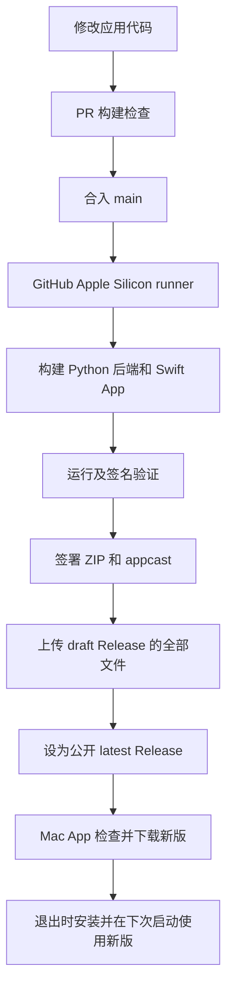

# AIChatApp 自动发布、部署与更新说明

[English](AUTO_UPDATE.en.md) · [架构说明](ARCHITECTURE.md) · [项目首页](../README.md)

新增功能说明：[加密备份与恢复](ENCRYPTED_BACKUP.md)。

记录日期：2026-10-01。本文对应已发布的 **0.3.4**，并说明当前仓库实际实现的自动发布和更新流程。

## 目录

1. [本次更新内容与验证记录](#1-本次更新内容与验证记录)
2. [部署结构与环境要求](#2-部署结构与环境要求)
3. [使用者：安装与首次配置](#3-使用者安装与首次配置)
4. [维护者：配置 GitHub 自动发布](#4-维护者配置-github-自动发布)
5. [日常修改代码与发布新版](#5-日常修改代码与发布新版)
6. [使用者：自动更新与手动更新](#6-使用者自动更新与手动更新)
7. [本地开发与打包验证](#7-本地开发与打包验证)
8. [签名、公证与密钥维护](#8-签名公证与密钥维护)
9. [故障排查与恢复](#9-故障排查与恢复)
10. [相关文件与参考资料](#10-相关文件与参考资料)

## 1. 本次更新内容与验证记录

之前需要在本地分别构建 Python 后端和 macOS 客户端，再手动上传安装包。现在，主分支的应用代码变化可直接触发 GitHub Actions 构建和发布，已安装更新器的 App 从 GitHub 获取新版。

| 改动 | 实际行为 |
| --- | --- |
| Sparkle 2.10.0 | 通过 Swift Package Manager 固定依赖版本，负责检查、下载、验证和替换 App |
| 更新入口 | App 菜单增加「检查更新…」，设置增加「软件更新」区域，支持中文、英文、挪威文 |
| 默认更新策略 | 每小时检查，自动下载；退出时安装，Sparkle 可能按系统权限和签名情况要求确认 |
| 更新范围 | 替换整个 `.app`，同时更新 Swift 客户端和内嵌 Python 后端 |
| GitHub Actions | Apple Silicon runner 构建后端、App、DMG、ZIP 和已签名 `appcast.xml` |
| 版本管理 | 自动生成显示版本、构建号及 release tag，无需每次手改版本 |
| 更新验证 | feed 和 ZIP 使用 Ed25519 签名；解压前验证更新包 |
| Framework 打包 | Sparkle 和 helper 裁剪为 arm64，保留 helper entitlements，从内到外重新签名 |
| 运行验证 | 检查打包后端的健康状态/退出、App 签名，以及实际打包更新器能否启动 |
| 首次打开说明 | Release 页面补充 Gatekeeper 的「隐私与安全性 → 仍要打开」步骤 |

首次正式发布记录：

- [功能 PR #1](https://github.com/gtsdrt/gtsdrt_ai_hub_macos/pull/1)，合并提交 `4ad2de7a8036c5f1669bdd42fc58be361a604045`。
- [正式发布构建](https://github.com/gtsdrt/gtsdrt_ai_hub_macos/actions/runs/36899106196)成功。
- [0.3.4 Release](https://github.com/gtsdrt/gtsdrt_ai_hub_macos/releases/tag/v0.3.4-build.1)：构建号 `10.4.1`，包含 DMG、ZIP 和 `appcast.xml`。
- 发布后下载真实 ZIP/feed，验证实际更新地址、版本号、文件大小、Ed25519 签名、App 代码签名和公钥一致性。
- 本地篡改 ZIP、替换错误构建号的验证均被拒绝；用户已确认本机 App 可以打开。

以上记录覆盖构建、发布、签名验证和首次启动。尚未完成一次用户实际使用中的「旧 0.3 版本 → 后续 0.3 版本」整包替换验收。

### 大字号输入框修复（2026-10-02）

已随 [0.3.6（构建 10.6.1）](https://github.com/gtsdrt/gtsdrt_ai_hub_macos/releases/tag/v0.3.6-build.1)发布，[PR #2](https://github.com/gtsdrt/gtsdrt_ai_hub_macos/pull/2) 和[正式发布构建](https://github.com/gtsdrt/gtsdrt_ai_hub_macos/actions/runs/36990546481)均通过检查。发布后重新下载真实 ZIP/feed，核对版本、大小、Ed25519 签名及 App 代码签名。

针对 200% 字号下设置页文字溢出输入框的问题，设置页、容器密钥和登录页统一使用按字体实际行高布局的输入控件，普通文字、占位提示和密码圆点均随字号调整高度。设置项的标签列加宽，窗口空间不足时改为标签在上、输入框在下，避免 `OPENAI_MODEL_NAME` 等长标签挤压输入区域。

本地验证包含完整 Xcode 构建，以及 80%、115%、200%、250% 字号、560/940 点宽度下的 32 个原生输入控件布局检查，并在运行中切换字号。更新后保留已保存的字号设置；通过「检查更新…」安装包含此修复的后续版本即可。

## 2. 部署结构与环境要求

GitHub 部署的是供用户下载的 macOS 安装包；客户端和 Python 后端仍在用户的 Mac 上运行，不会因启用更新而迁移到 GitHub 服务器。



| 环境 | 当前要求 |
| --- | --- |
| 使用者 Mac | macOS 13+，Apple Silicon / arm64；不支持 Intel 或 Rosetta |
| 安装发布包 | 不需要安装 Python、Xcode 或后端依赖 |
| 本地开发 | Apple Silicon Mac、支持当前 Xcode 工程的 Xcode、原生 arm64 Python、Git |
| GitHub 构建 | `macos-15` runner，Python 3.13 arm64，PyInstaller 6.x |
| 更新组件 | Sparkle 2.10.0，版本同时固定在 Xcode 工程与 workflow |
| 发布位置 | 当前公开仓库的 GitHub Releases，无需 GitHub Pages |
| 网络 | 使用者可访问 GitHub 的 feed 和 release 下载地址；构建机可下载依赖 |
| 首装信任状态 | 当前为 ad-hoc 签名，未接入 Developer ID / Apple 公证 |

## 3. 使用者：安装与首次配置

### 3.1 下载安装

1. 打开[最新版 Releases](https://github.com/gtsdrt/gtsdrt_ai_hub_macos/releases/latest)，下载 `AIChatApp-<版本>.dmg`。
2. 打开 DMG，把 `AIChatApp.app` 拖入 `/Applications`，替换旧版前先退出正在运行的 App。
3. 从「应用程序」启动 App；不要直接从只读 DMG 中长期运行，否则更新无法写回 App。
4. 首次配置管理员登录、AI Provider 和需要的运维工具凭据，保存配置并按界面提示重启后端。

`0.2.7` 及更早版本没有更新器，必须先手动安装一次 `0.3` 系列。已安装 `0.3.4` 的使用者无需再次安装同一个版本。

如需核对这次正式发布的 DMG：

```bash
shasum -a 256 ~/Downloads/AIChatApp-0.3.4.dmg
```

`0.3.4` DMG 的 GitHub release asset SHA-256 为：

```text
2004452a7e2d4e8a8eb17002e9512d0402c7294fb96d5cb7dd69bd65a5640437
```

此哈希只对应 `v0.3.4-build.1`；其他版本应核对各自 asset digest。文件哈希用于核对内容，不代表 Apple 公证。

### 3.2 首次打开出现 Apple 无法验证恶意软件的提示

当前包缺少 Developer ID 签名及 Apple 公证，因此可能出现：

> Apple could not verify “AIChatApp” is free of malware that may harm your Mac or compromise your privacy.

确认安装包来自本项目后，按 [Apple 官方说明](https://support.apple.com/en-us/102445)：

1. 尝试打开 App，关闭阻拦提示。
2. 打开「系统设置 → 隐私与安全性」，找到 AIChatApp 的阻拦记录。
3. 点击「仍要打开（Open Anyway）」，按提示确认并验证本机登录身份。
4. 再次打开 App。较新的 macOS 不能仅靠右键「打开」完成这一步。

本次维护在确认已安装 App 与发布包签名哈希一致后，仅移除了该 App 的下载隔离标记，随后用户确认可以打开。此本机处理没有为发布包增加 Apple 公证；其他 Mac 仍可能需要首装确认。

### 3.3 运行配置与数据位置

- 内嵌后端默认为 `http://127.0.0.1:8000`；在设置中启用「启动应用时自动拉起本地后端」。
- 管理员用户名、密码和 AI Provider 在设置页配置；凭据进入 Keychain，启动本地后端时通过环境变量传递。
- Azure、Meraki、Nexus Dashboard 和容器连接按实际需要配置；其他功能详见[架构文档](ARCHITECTURE.md)和[客户端说明](../AIChatApp/README.md)。

| 数据 | 默认位置 |
| --- | --- |
| 聊天数据库 | `~/Library/Application Support/AIChatApp/aichat.db`，可被 `AICHAT_DB_PATH` 覆盖 |
| 后端 PID 文件 | `~/Library/Application Support/AIChatApp/backend.pid` |
| 后端日志 | `~/Library/Logs/AIChatApp/backend.log` |
| 非敏感设置 | UserDefaults，当前 bundle ID 为 `com.example.AIChatApp` |
| token / 密码 / API key | macOS Keychain，当前 service 为 `com.example.AIChatApp` |

这些数据在 App bundle 外，普通整包更新保留它们。更新前退出 App 会沿用已有后端进程清理逻辑。

## 4. 维护者：配置 GitHub 自动发布

### 4.1 获取代码与检查 Actions

当前仓库已配置并成功发布；以下步骤用于复核、迁移或重新部署。

```bash
git clone https://github.com/gtsdrt/gtsdrt_ai_hub_macos.git
cd gtsdrt_ai_hub_macos
gh auth login
gh secret list --repo gtsdrt/gtsdrt_ai_hub_macos
```

在仓库 **Settings → Actions → General** 启用 Actions，并允许 workflow 引用的 actions。工作流文件为 [`.github/workflows/macos-release.yml`](../.github/workflows/macos-release.yml)，发布 job 明确申请 `contents: write`；`GH_TOKEN` 使用内置 `github.token`，无需额外部署 PAT。

当前 workflow 使用 `actions/checkout@v4`、`actions/setup-python@v5` 和 `actions/upload-artifact@v4`。仓库或组织的 Actions 策略需要允许这些 actions 和发布权限。

### 4.2 配置现有仓库的更新私钥

唯一必须配置的更新发布 secret 为 `SPARKLE_PRIVATE_KEY`，其值是与 `SUPublicEDKey` 对应的 Sparkle Ed25519 私钥文本。当前仓库已配置。

本机的现有备份是 `.sparkle/eddsa-private.key`，文件权限 `0600`，目录被 Git 忽略。私钥不随 clone 下载；迁移到另一台机器时，应从安全备份恢复它，而不是重新生成。

```bash
# 在安全恢复现有私钥文件后执行，不要打印文件内容。
gh secret set SPARKLE_PRIVATE_KEY \
  --repo gtsdrt/gtsdrt_ai_hub_macos < .sparkle/eddsa-private.key
```

也可在 **Settings → Secrets and variables → Actions → New repository secret** 设置同名 secret。不要把私钥、`.env`、Apple 证书或运行数据库提交到 Git 或上传为构建 artifact。

### 4.3 新产品 / fork 的部署

新产品使用自己的更新密钥和发布地址。Sparkle 官方 distribution 的 `bin/generate_keys` 可以生成密钥；以下示例只用于新产品，不能用于替换当前已发布 App 的现有密钥：

```bash
mkdir -p .sparkle
chmod 700 .sparkle
/path/to/Sparkle/bin/generate_keys --account "my-org.aichat-updates"
/path/to/Sparkle/bin/generate_keys --account "my-org.aichat-updates" \
  -x .sparkle/eddsa-private.key
chmod 600 .sparkle/eddsa-private.key
```

将生成的公钥写入 `AIChatApp/Support/Info.plist` 的 `SUPublicEDKey`，私钥写入新仓库的 `SPARKLE_PRIVATE_KEY` secret。将 `SUFeedURL` 改为新仓库的：

```text
https://github.com/<owner>/<repo>/releases/latest/download/appcast.xml
```

workflow 的下载前缀使用 `GITHUB_REPOSITORY`，会跟随新仓库；`Info.plist` 中的 feed URL 则需要手动调整。当前验证脚本要求下载域名为 `github.com`；换自托管域名时也需要修改对应验证。

独立产品应规划自己的 bundle ID、Keychain service 和数据目录；对已有用户迁移时要处理设置及凭据兼容。当前 App 的无鉴权 feed/download 方案面向公开 release，不能直接用于仅登录后可访问的私有仓库。

## 5. 日常修改代码与发布新版

### 5.1 推荐流程

1. 创建功能分支，修改应用代码、后端、依赖或构建脚本。
2. 提交并创建 PR。PR 跑构建验证、上传 artifact，但不读取更新私钥、不发布 Release。
3. 检查 PR 的 Actions 结果，合入 `main`。
4. 在 **Actions → Build and publish macOS update** 查看正式构建。
5. 在 Releases 确认新版本含 DMG、ZIP、`appcast.xml`，并被设为 `latest`。
6. 用已安装的较旧 `0.3` 版本手动检查更新，验收下载、退出安装、重启后的版本及后端连接。

可以直接从 GitHub 网页修改代码并合入 `main`，发布仍在云端执行。普通改动无需在本地生成 DMG。

### 5.2 哪些提交会触发构建

当前 push / PR paths 是：`AIChatApp/**`、`**/*.py`、`backend.spec`、`requirements*.txt`、`scripts/**` 及 workflow 文件本身。

仅改 `docs/**` 或根 `README.md` 不触发发布；**`AIChatApp/README.md` 属于 `AIChatApp/**`，目前也会触发**。不要把所有文档改动都理解为自动跳过。

### 5.3 手动触发与重试

在 Actions 页面选择 workflow，点击 **Run workflow**，选择 `main`。或：

```bash
gh workflow run macos-release.yml --ref main \
  --repo gtsdrt/gtsdrt_ai_hub_macos
gh run list --workflow macos-release.yml \
  --repo gtsdrt/gtsdrt_ai_hub_macos
```

手动运行其他分支只构建，不发布。工作流失败后可查看日志并使用 **Re-run failed jobs** / **Re-run all jobs**；重试增加 `run_attempt`，因此使用独立 release tag。

### 5.4 自动版本号

| 字段 | 当前生成规则 | 首次正式发布 |
| --- | --- | --- |
| 显示版本 | 工程 `MARKETING_VERSION` 前两段 + `run_number` | `0.3.4` |
| 构建号 | `10.<run_number>.<run_attempt>` | `10.4.1` |
| Release tag | `v<显示版本>-build.<run_attempt>` | `v0.3.4-build.1` |

PR 也消耗运行编号，所以正式版本的末位可能跳号；重试的显示版本可能相同，但构建号不同。Sparkle 以 `CFBundleVersion` 比较更新。

源码中的 `0.3.0` 是发布系列的基准，不代表 Releases 最新版本。切换系列时调整工程版本前两段；同时保持构建号严格递增。不要删除重建 workflow、重置编号或发布低于已安装用户构建号的包。

### 5.5 实际发布顺序与验证

生产构建通过 concurrency 串行执行，避免较慢的旧构建覆盖新版 feed。流程依次：

1. 安装 Python 依赖，PyInstaller 构建 onedir arm64 后端。
2. 检查后端架构、`/api/health`、工具注册和退出后的端口/进程清理。
3. Xcode archive App；裁剪和重新签名 Sparkle/helper；校验整包 arm64。
4. ad-hoc 签署 App，验证完整代码签名，生成并验证 DMG。
5. 用实际打包 framework/Info.plist 初始化 Sparkle 更新器，拦截无效配置。
6. 生成仅包含 App 的更新 ZIP。
7. 主分支使用私钥生成并签署 appcast/ZIP，独立验证版本、大小、GitHub HTTPS URL 和 ZIP 签名。
8. 上传构建 artifact，创建 draft Release 并上传全部发布文件。
9. 将 draft 转为公开 Release，并设为 `latest`。
10. 清理 runner 临时私钥。

只有最后的公开 Release 才成为正常用户的更新入口。失败不会切换 `latest`；如上传阶段中断留下 draft，先检查并清理/完成 draft，再重试，避免同一个 tag 的创建冲突。

## 6. 使用者：自动更新与手动更新

### 自动更新

安装过支持更新器的版本后，在「设置 → 软件更新」保留：

- 「自动检查更新」：默认启用，每小时检查。
- 「自动下载并在退出时安装更新」：默认启用；关闭自动检查时此选项可能不可选。

App 读取最新 `appcast.xml`，校验 feed 签名并比较构建号，验证更新 ZIP 后安装。使用者可以关闭这些开关；Sparkle 记住选择，启动 App 不会强制覆盖已保存的偏好。

自动下载不等于立刻中断正在进行的对话。按 Sparkle 的提示退出或安装并重启后，在设置页确认显示版本/构建号，再检查后端能否连接。

### 手动检查

App 菜单选择「检查更新…」，或在「设置 → 软件更新」点击同名按钮。更新进行中按钮可能暂时禁用；无新版、网络失败或验签失败会按 Sparkle 的提示处理。

### 手动替换

无法使用更新器、旧版没有更新器或需要修复损坏安装时：退出 App，从 Releases 下载最新版 DMG，替换 `/Applications/AIChatApp.app` 后启动。保留 Application Support、UserDefaults 和 Keychain 中的数据。

## 7. 本地开发与打包验证

以下命令从仓库根目录执行。使用原生 arm64 终端和 Python，避免 Rosetta；发布包使用者无需做这些步骤。

```bash
python3 -m venv .venv
.venv/bin/python -m pip install -r requirements-fastapi.txt \
  'pyinstaller>=6.16,<7' 'cryptography>=42'

# 开发构建
xcodebuild -project AIChatApp/AIChatApp.xcodeproj -scheme AIChatApp \
  -configuration Debug -derivedDataPath .xcbuild build
open .xcbuild/Build/Products/Debug/AIChatApp.app

# 完整发布构建与运行验证（仅本地产物，默认不发布、不签署更新 feed）
RELEASE_VERSION=0.3.0 RELEASE_BUILD=10.0.1 \
RELEASE_PYTHON=.venv/bin/python bash scripts/build_release.sh
```

主要产物：`AIChatApp/AIChatApp-<版本>.dmg`、`release-output/AIChatApp-<版本>.dmg` 和 `.zip`。构建目录与产物已被 Git 忽略。

如需本地测试 appcast 签名，使用实际存在的 Sparkle 2.10.0 distribution 工具和已恢复的现有私钥：

```bash
RELEASE_VERSION=0.3.0 RELEASE_BUILD=10.0.1 \
RELEASE_PYTHON=.venv/bin/python PUBLISH_UPDATE=1 \
SPARKLE_PRIVATE_KEY_FILE="$PWD/.sparkle/eddsa-private.key" \
SPARKLE_TOOLS_DIR="/path/to/Sparkle/bin" \
RELEASE_DOWNLOAD_URL="https://github.com/gtsdrt/gtsdrt_ai_hub_macos/releases/download/local-test" \
bash scripts/build_release.sh
```

这里 `PUBLISH_UPDATE=1` 只生成并验证本地 feed；实际上传由 workflow 的发布步骤执行。`local-test` URL 是占位地址，不会自动产生远程 release。已有测试 feed/ZIP 时使用干净构建输出，避免旧版本条目干扰验证；不要把测试 feed 上传为正式 latest。

## 8. 签名、公证与密钥维护

### 当前已实现

- GitHub secret 保存更新私钥；App 只嵌入公钥。
- `SURequireSignedFeed=true`、`SUVerifyUpdateBeforeExtraction=true`。
- `SUEnableAutomaticChecks=true`、`SUAutomaticallyUpdate=true`、`SUScheduledCheckInterval=3600` 作为初始偏好。
- App / framework 使用 ad-hoc 签名，CI 关闭 hardened runtime；release ZIP/feed 使用 Ed25519 签名。

### 尚未接入：Developer ID 与 Apple 公证

要让新下载的安装包通过开发者身份和公证检查，需要 Apple Developer Program、Developer ID Application 证书及可用公证凭据。当前 CI 没有证书导入、notarytool submit、stapler 或 Gatekeeper 放行验收步骤。

正式接入时需要完成：证书安全导入临时 Keychain；后端、Python 动态库、Sparkle/helper 与 App 的嵌套签名及 hardened runtime 配置；提交 Apple 公证并检查结果；staple ticket；重新生成最终 ZIP/DMG 后才生成 Sparkle 签名；再验证 Gatekeeper 和实际更新。

**不能只新增 Apple secret 或给外层 App 签名就认定已完成公证。** 当前 `build_release.sh` 强制 `CI_ADHOC_SIGN=1`，Developer ID 路径需要相应调整和验收。Apple 证书、账号密码或 API 私钥应进入安全存储/Actions secrets，不能写入本文或代码。


以下是**未来接入公证时的本地命令示例**，前提是 `/path/to/Developer-ID-signed/` 下的 App 和 ZIP 已完成符合公证要求的嵌套 Developer ID 签名及 hardened runtime 配置。不能对当前 ad-hoc 包直接执行并期望通过：

```bash
security find-identity -v -p codesigning
# 交互输入 Apple 登录/团队信息和公证凭据，保存在本机 Keychain。
xcrun notarytool store-credentials AIChatApp-notary
xcrun notarytool submit "/path/to/Developer-ID-signed/AIChatApp.zip" \
  --keychain-profile AIChatApp-notary --wait
# 只在返回 Accepted 后继续；失败时先查看 notarization log。
xcrun stapler staple "/path/to/Developer-ID-signed/AIChatApp.app"
xcrun stapler validate "/path/to/Developer-ID-signed/AIChatApp.app"
spctl --assess --type execute --verbose=4 \
  "/path/to/Developer-ID-signed/AIChatApp.app"
```

之后用已 staple 的 App 重新打包最终 ZIP/DMG，并对最终更新文件重新生成 Sparkle 签名。若还要 staple DMG，需提交该 DMG 的公证并检查 Accepted，再 staple/validate DMG。上述本机 Keychain profile 不会自动存在于 GitHub runner；CI 必须另行配置自己的安全认证和证书导入。

### 备份与更换更新密钥

私钥应有安全的离线或密码管理器备份。当前 ad-hoc + 强制提前验签方案下，私钥丢失不能通过随意替换公钥继续为已有安装推送更新。证书/密钥迁移按 [Sparkle 文档](https://sparkle-project.org/documentation/) 单独规划，不要在普通发版中重新生成密钥。

## 9. 故障排查与恢复

| 现象 | 检查与处理 |
| --- | --- |
| Apple 无法验证恶意软件 | 按第 3.2 节处理；永久改善需要第 8 节的正式签名/公证部署 |
| `Missing repository secret SPARKLE_PRIVATE_KEY` | 恢复与 App 公钥对应的现有私钥，重新设置 secret 并重跑 |
| feed / ZIP 验签失败 | 检查私钥、公钥、实际 archive、签署顺序；修改签名后的 XML/ZIP 必须重新签名 |
| 更新地址 404 | 最新公开 Release 必须有 `appcast.xml`；不要把缺少 feed 的旧版设为 latest |
| 手动检查提示没有新版 | 检查用户构建号、feed 构建号、跳过的版本以及最新 Release；显示版本相同的重试仍可能有新构建 |
| 更新器不能启动 | 查 `verify_updater.swift` 的日志，确认两个 signed-feed / before-extraction 设置都存在 |
| 构建混入 x86_64 | 用原生终端/Python，确认 runner 为 arm64，并查看架构闸门指向的具体文件 |
| App 不能写回更新 | 从 DMG 复制到 `/Applications` 后运行，检查安装目录权限，按系统提示授权 |
| 后端无法连接 | 设置页检查启动开关、地址和后端日志；默认健康检查为 `curl http://127.0.0.1:8000/api/health`，自定义端口相应调整 |
| Release 已创建但发版步骤失败 | 检查 draft 和 tag 是否存在，核对文件完整性后清理/完成 draft 或用新 run attempt 重试 |

Sparkle 错误可在 macOS Console 中查找；后端日志在 `~/Library/Logs/AIChatApp/backend.log`。查看日志时不要把 API key 或其他凭据贴到公开 issue。

### 恢复有问题的版本

1. 停止继续分发错误版本，保留问题的构建日志。
2. 修复代码并发布构建号更高的版本，让已更新用户能正常升级。
3. 必须手动回到旧包时，先退出 App 并备份数据库，再安装已有旧 DMG；旧应用与较新数据库的兼容性需要检查。
4. 不要简单把没有 appcast 的 `0.2.x` release 标成 latest；这会使更新入口变成 404。把较低构建号设为 latest 也不会让已安装新版的 Sparkle 自动降级。

## 10. 相关文件与参考资料

| 文件 | 作用 |
| --- | --- |
| [workflow](../.github/workflows/macos-release.yml) | 触发条件、runner、secrets、版本生成与 Release 发布 |
| [AppUpdater.swift](../AIChatApp/Sources/Services/AppUpdater.swift) | 更新器生命周期和用户偏好 |
| [Info.plist](../AIChatApp/Support/Info.plist) | feed URL、公钥、签名策略及初始更新设置 |
| [build_release.sh](../scripts/build_release.sh) | 后端、App、运行验证、ZIP、签署 appcast |
| [build_dmg.sh](../AIChatApp/scripts/build_dmg.sh) | Xcode archive、App 签名和 DMG |
| [prepare_sparkle.sh](../scripts/prepare_sparkle.sh) | framework/helper 裁剪与嵌套签名 |
| [verify_backend_binary.py](../scripts/verify_backend_binary.py) | 打包后端的健康和退出验证 |
| [verify_updater.swift](../scripts/verify_updater.swift) | 实际更新器初始化检查 |
| [verify_update_feed.py](../scripts/verify_update_feed.py) | 版本、大小、下载 URL 与 ZIP 签名验证 |

参考：[Sparkle 发布说明](https://sparkle-project.org/documentation/publishing/)、[Apple 首次打开说明](https://support.apple.com/en-us/102445)、[Developer ID 证书](https://developer.apple.com/help/account/certificates/create-developer-id-certificates/)、[GitHub 手动运行 workflow](https://docs.github.com/en/actions/how-tos/manage-workflow-runs/manually-run-a-workflow)。
